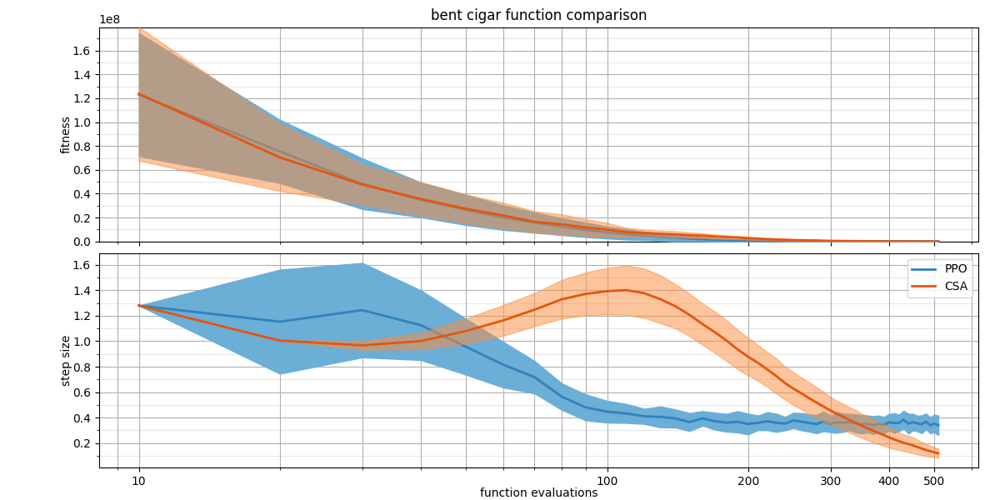
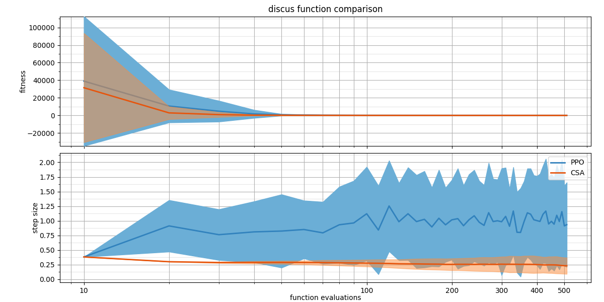
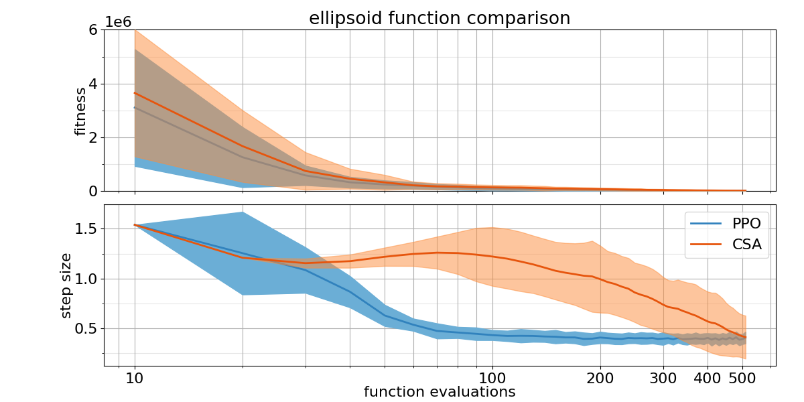
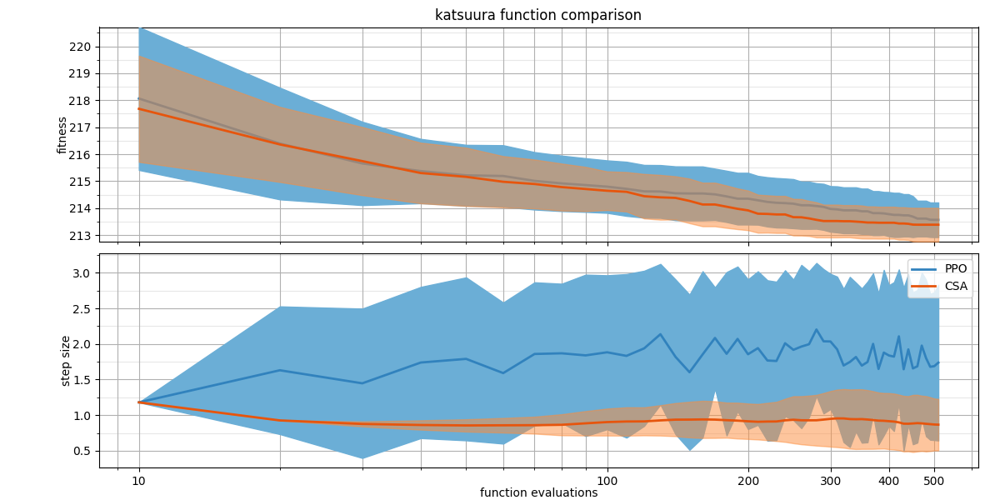
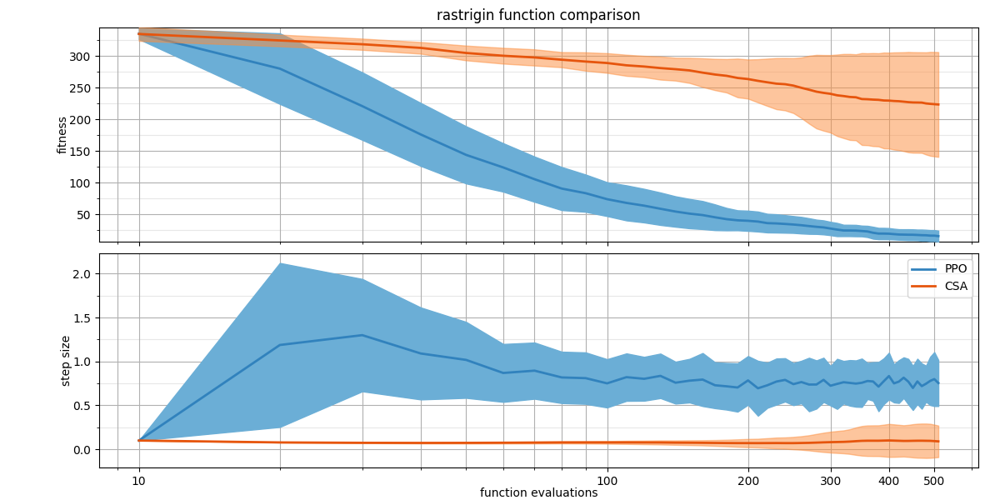
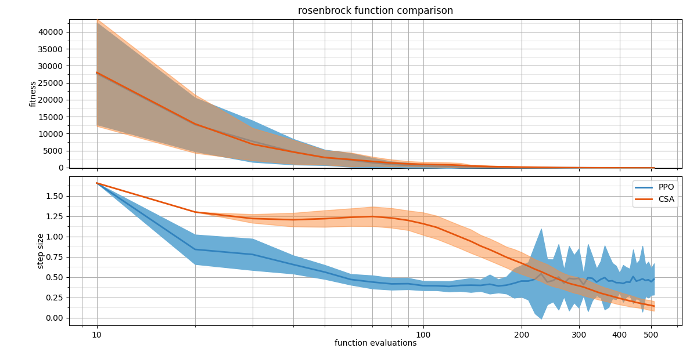
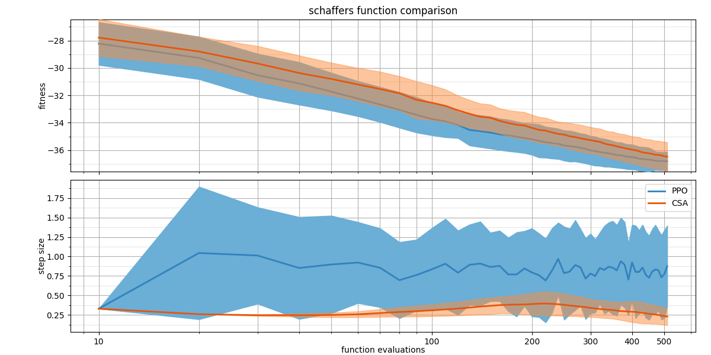
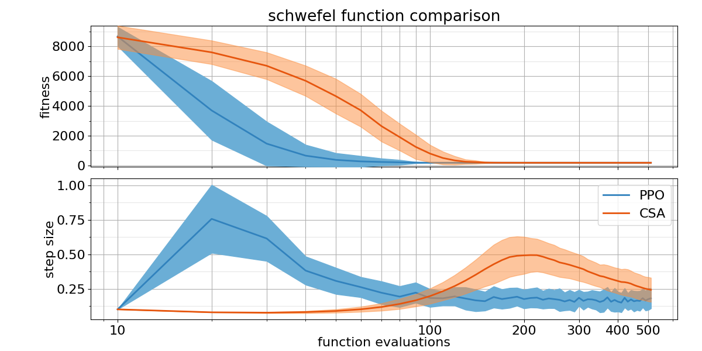
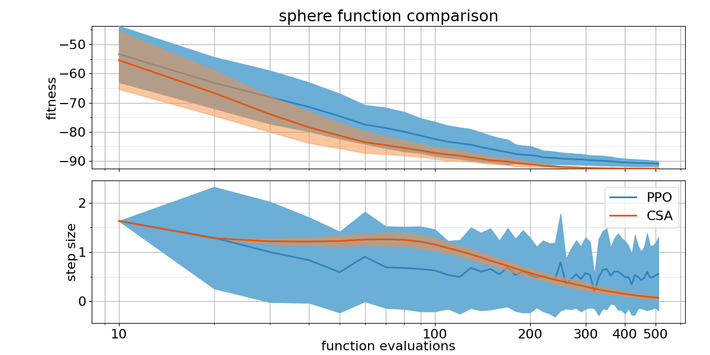
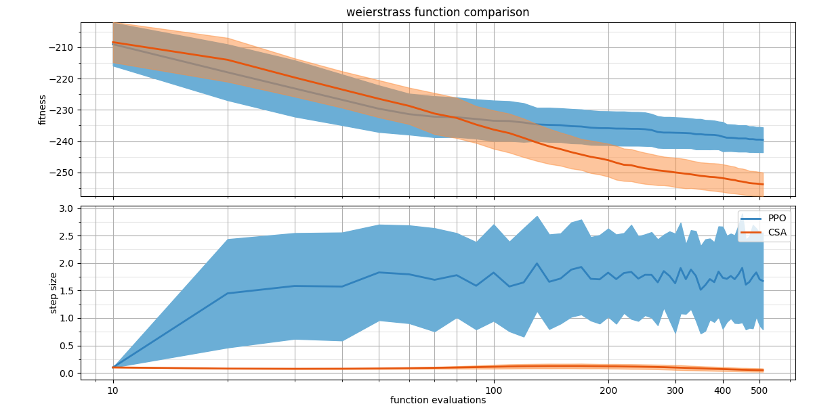

## Comparison Table

Probability of PPO trained policy outperforming CSA using 2 different metrics: Area under the curve and the absolute best of the run.

| Function    | $p(PPO < CSA)$ with AUC metric | $p(PPO < CSA)$ with best metric |
| :---------- | ------------------------------ | ------------------------------- |
| bentcigar   | 0.59                           | 0.02                            |
| discus      | 0.35                           | 0.15                            |
| ellipsoid   | 0.68                           | 0.61                            |
| katsuura    | 0.36                           | 0.44                            |
| rastrigin   | 1                              | 0.985                           |
| rosenbrock  | 0.56                           | 0.16                            |
| schaffers   | 0.77                           | 0.61                            |
| schwefel    | 0.99                           | 0.74                            |
| sphere      | 0.08                           | 0.0                             |
| weierstrass | 0.06                           | 0.01                            |

## Plots

##### Bent Cigar

##### Discus

##### Ellipsoid

##### Katsuura

##### Rastrigin

##### Rosenbrock

##### Schaffers

##### Schwefel

##### Sphere

##### Weierstrass

