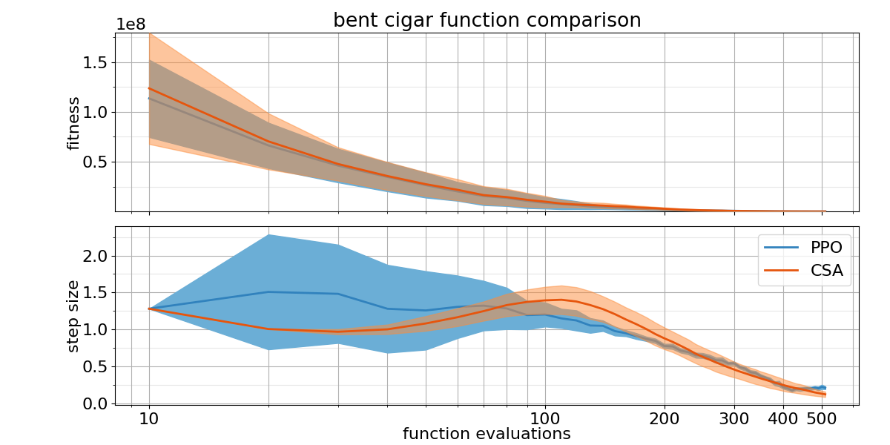
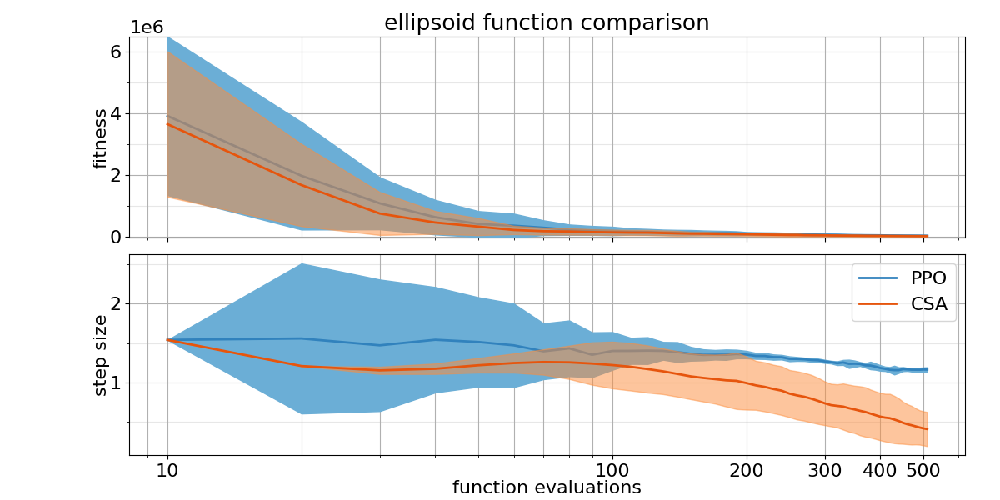
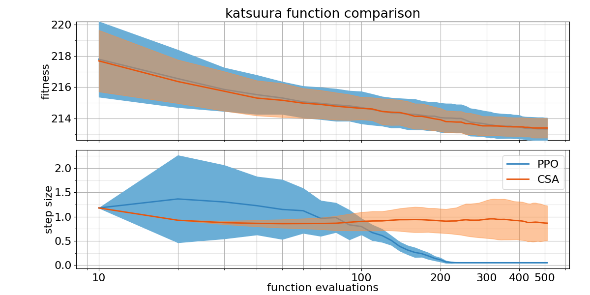
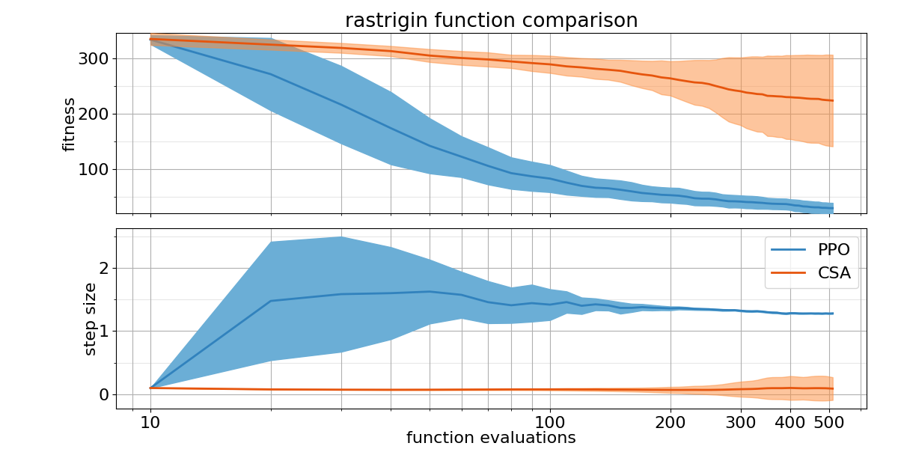
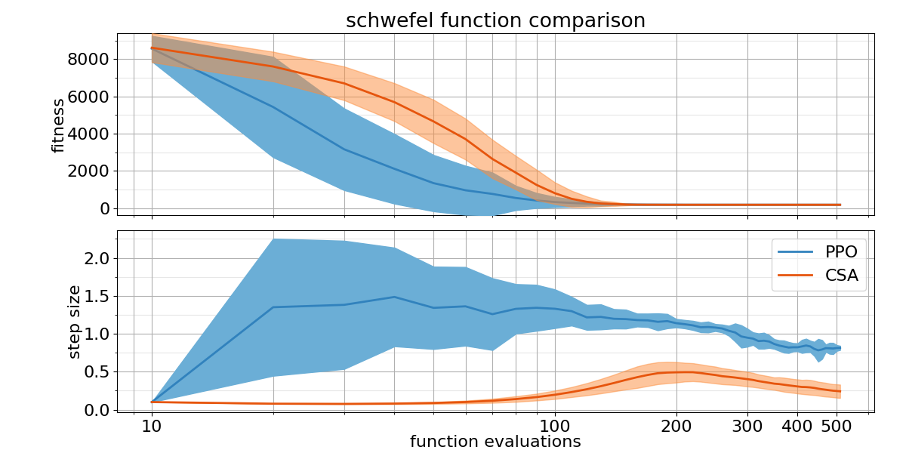
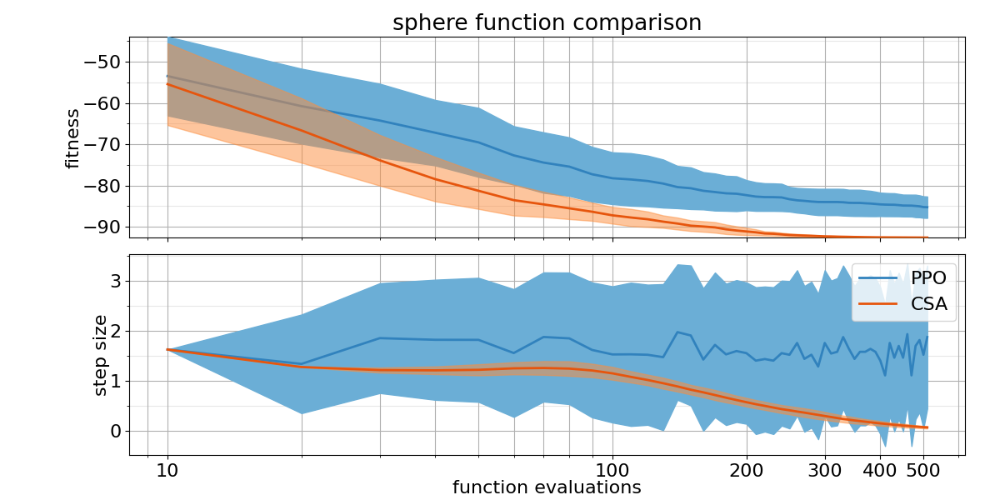
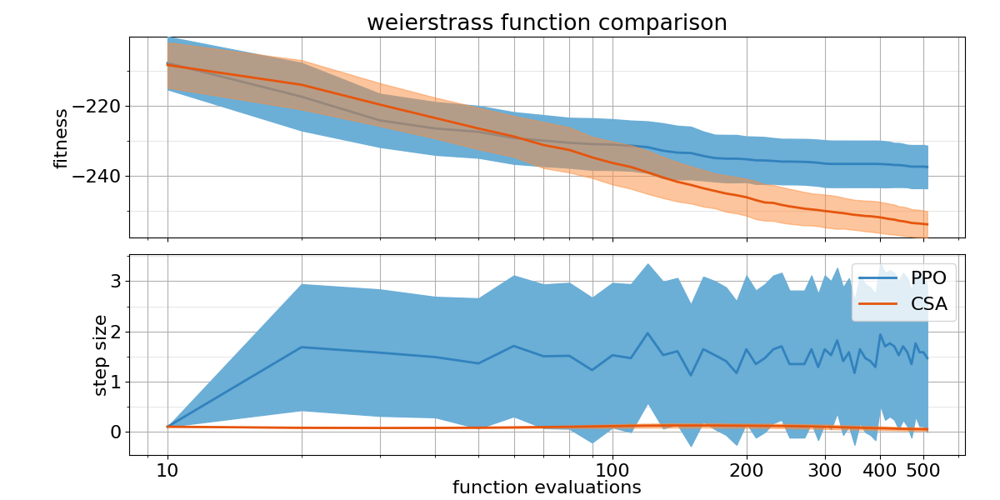

# Results

* Trained with a model similar as possible to the "Learning Step-Size Adaptation in CMA-ES" one
* It has training instabilities: for some reason with some objective function (discus, rosenbrock, shaffers) is very likely to get NaN weights in the model during training. This is solved by using tanh rather than ReLu as activation function.

## Comparison Table

Probability of PPO trained policy outperforming CSA using 2 different metrics: Area under the curve and the absolute best of the run.

| Function    | $p(PPO < CSA)$ with AUC metric | $p(PPO < CSA)$ with best metric |
| :---------- | ------------------------------ | ------------------------------- |
| bentcigar   | 0.58                           | 0.17                            |
| discus      | ---                            | ---                             |
| ellipsoid   | 0.35                           | 0.22                            |
| katsuura    | 0.50                           | 0.54                            |
| rastrigin   | 1                              | 0.95                            |
| rosenbrock  | ---                            | ---                             |
| schaffers   | ---                            | ---                             |
| schwefel    | 0.94                           | 0.27                            |
| sphere      | 0.0                            | 0.0                             |
| weierstrass | 0.08                           | 0.01                            |

## Plots

##### Bent Cigar



##### Discus


##### Ellipsoid



##### Katsuura



##### Rastrigin



##### Rosenbrock


##### Schaffers


##### Schwefel



##### Sphere



##### Weierstrass



## Configuration

params depending by the object functions: 
- **vf_clip_param:** [1e7, 10000, 2e5, 100, 100, 1e4, 10, 5000, 50, 100],
- **obj fun id:** [12, 11, 2, 23, 15, 8, 17, 20, 1, 16],
- **initial sigma:** [1.28, 0.38, 1.54, 1.18, 0.1, 1.66, 0.33, 0.1, 1.63, 0.1],

```python
{
    "agent.algorithm": "RayProximalPolicyOptimization",
    "agent.algorithm.render_env": False,
    "agent.algorithm.num_workers": 0,
    "agent.algorithm.batch_mode": "complete_episodes",
    "agent.algorithm.lr": 1e-5,
    "agent.algorithm.train_batch_size": 200,
    "agent.algorithm.optimizer": "Adam",
    "agent.algorithm.vf_clip_param": 1e7, # param dependent from obj fun
    "agent.algorithm.model": {
        "fcnet_activation": "relu",
        "fcnet_hiddens": [50, 50],
    },
    "env.env_class": "SchedulerPolicyRayEnvironment",
    "env.env_config": {
        "solver_driver": "CMAdriver",
        "solver_driver_args": [10, 10, 12, 1.28], # fun and init sigma dependent by the obj fun
        "maximize": False,
        "steps": 50,
        "state_metrics_names": ["DifferenceOfBest", "SolverStateHistory", "SolverState"],
        "state_metrics_config": [
            (40, False, 1, True, False),
            ({"step_size": {"max": 3, "min": 0}}, 40),
            ({"ps": {"max": 10, "min": -10}},),
        ],
        "reward_metric": "Best",
        "reward_metric_config": [False, True],  # (maximize=True, use_best_of_run=False)
        "memes_no": 1,
        "action_space_config": {"step_size": {"max": 3, "min": 0.05}},
    },
}
```

