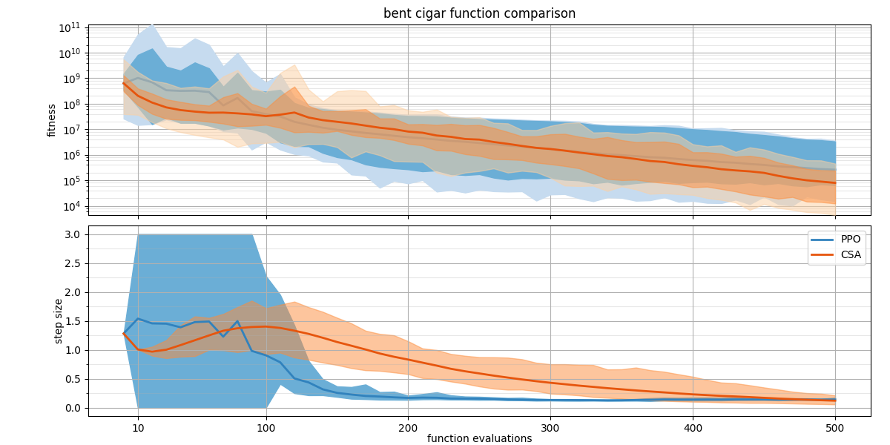
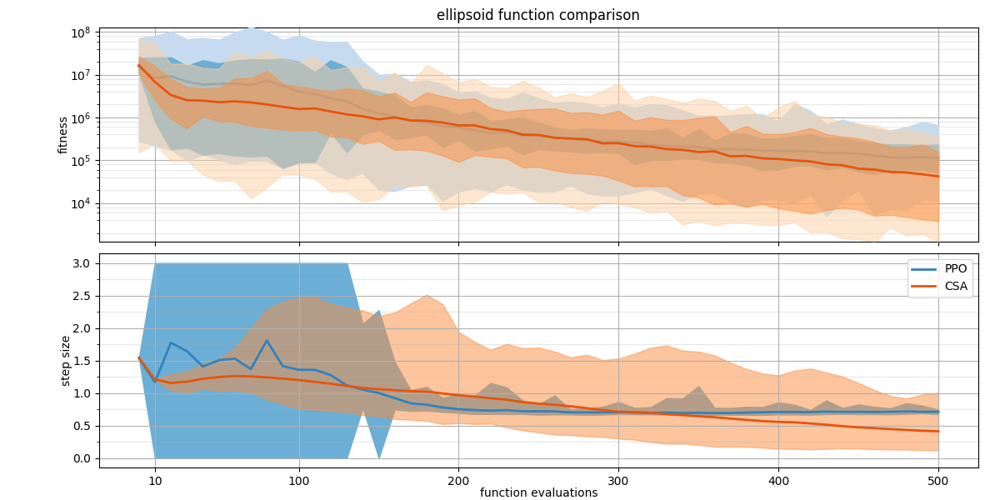
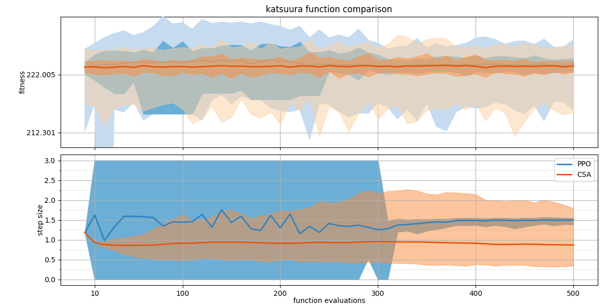
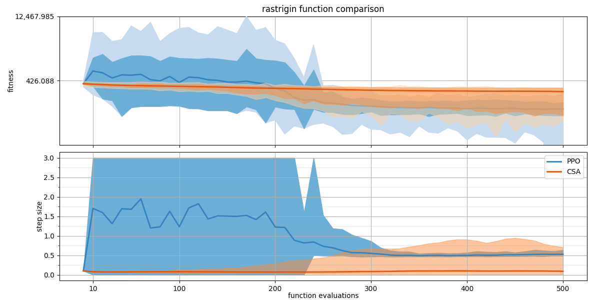
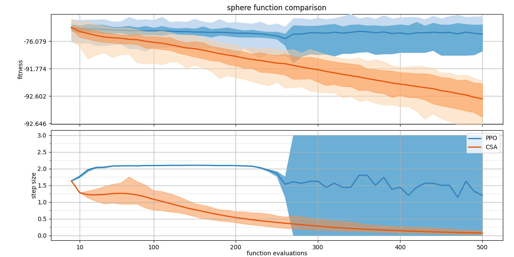
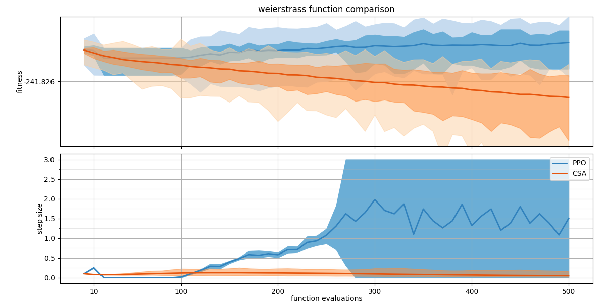

## Comparison Table

Probability of PPO trained policy outperforming CSA using 2 different metrics: Area under the curve and the absolute best of the run.

| Function    | $p(PPO < CSA)$ with AUC metric | $p(PPO < CSA)$ with best metric |
| :---------- | ------------------------------ | ------------------------------- |
| bentcigar   | 0.15                           | 0.41                            |
| discus      | 0.0012                         | 0.0884                          |
| ellipsoid   | 0.10                           | 0.23                            |
| katsuura    | 0.01                           | 0.42                            |
| rastrigin   | 0.98                           | 0.96                            |
| rosenbrock  | 0.49                           | 0.12                            |
| schaffers   | 0.03                           | 0.59                            |
| schwefel    | 0.87                           | 0.73                            |
| sphere      | 0.0                            | 0.0                             |
| weierstrass | 0.0                            | 0.02                            |

## Plots

##### Bent Cigar

##### Discus

##### Ellipsoid

##### Katsuura

##### Rastrigin

##### Rosenbrock

##### Schaffers

##### Schwefel

##### Sphere

##### Weierstrass

