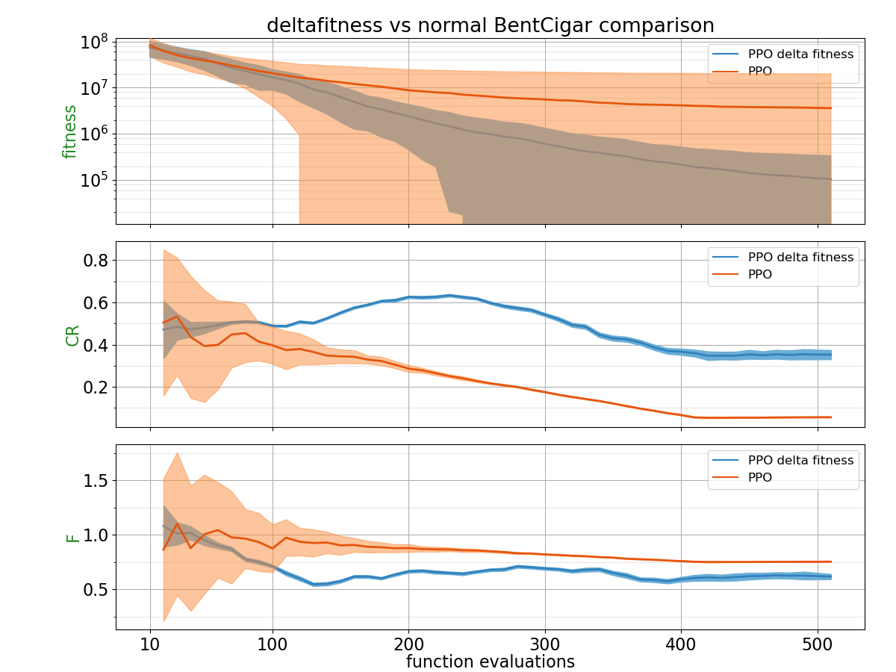
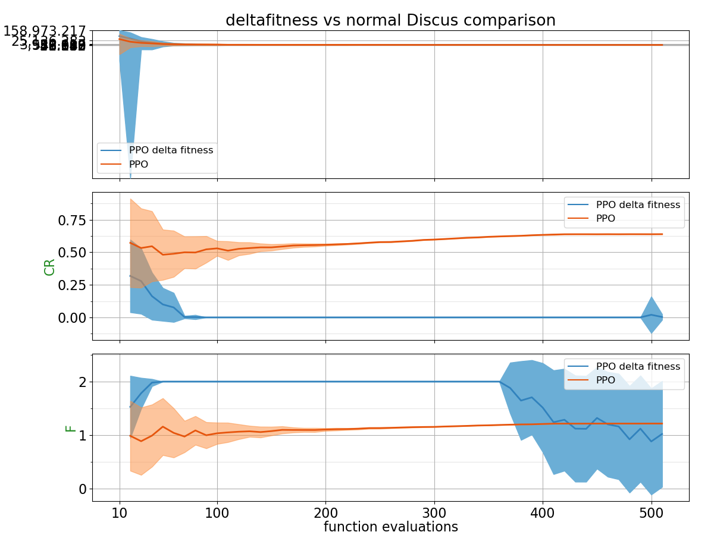
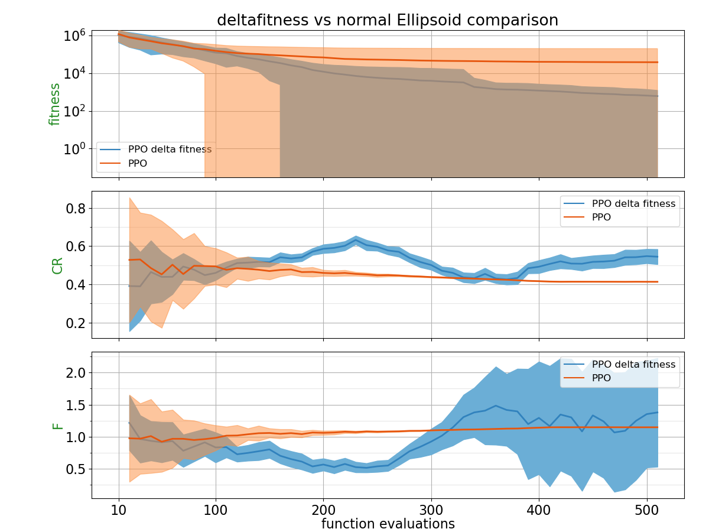
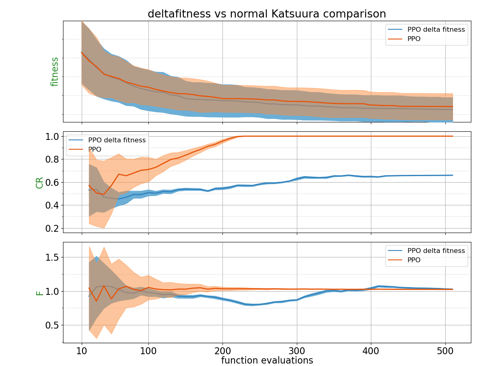
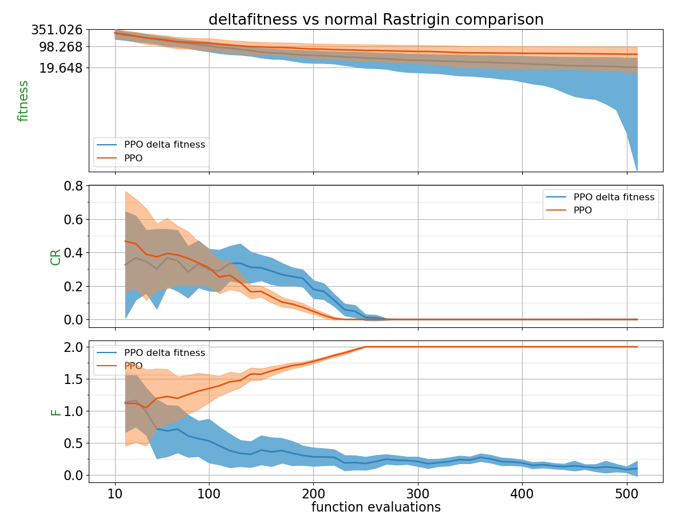
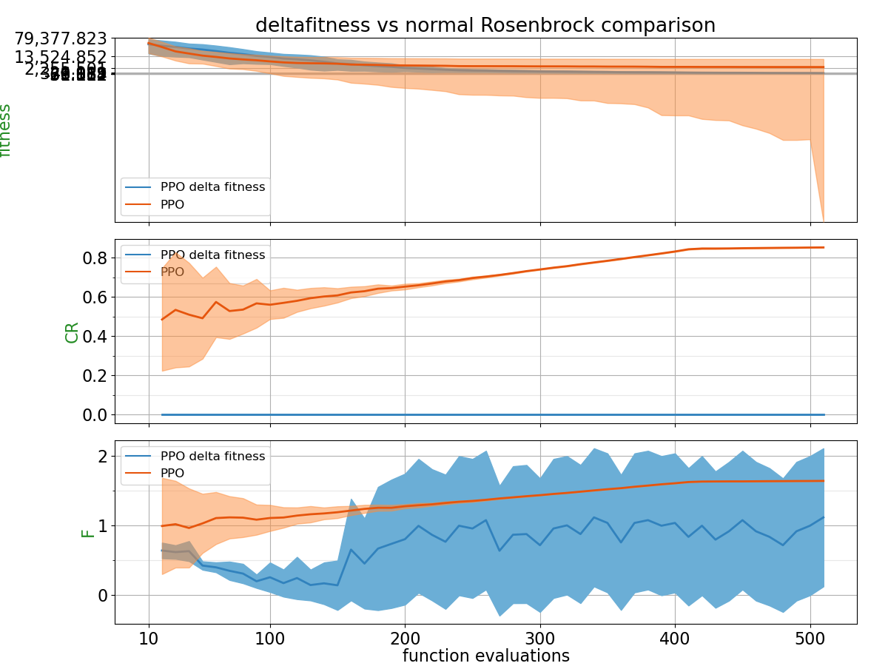
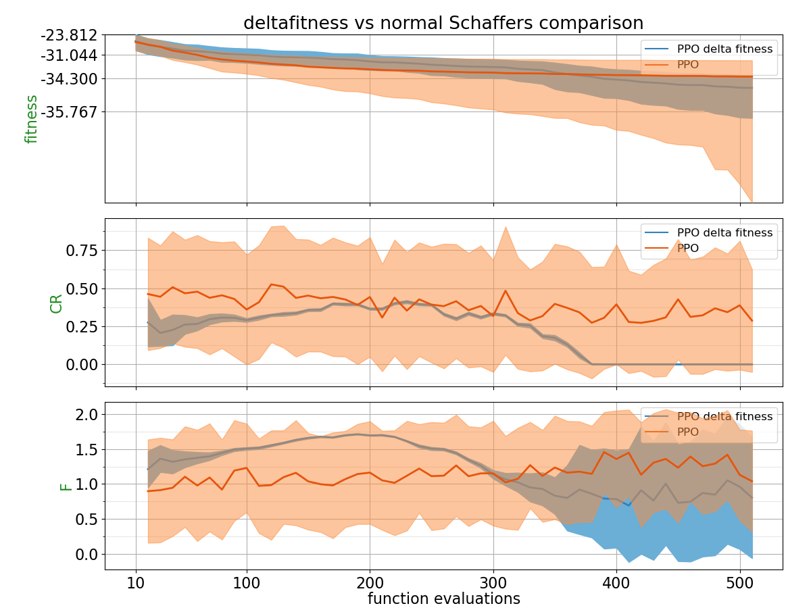
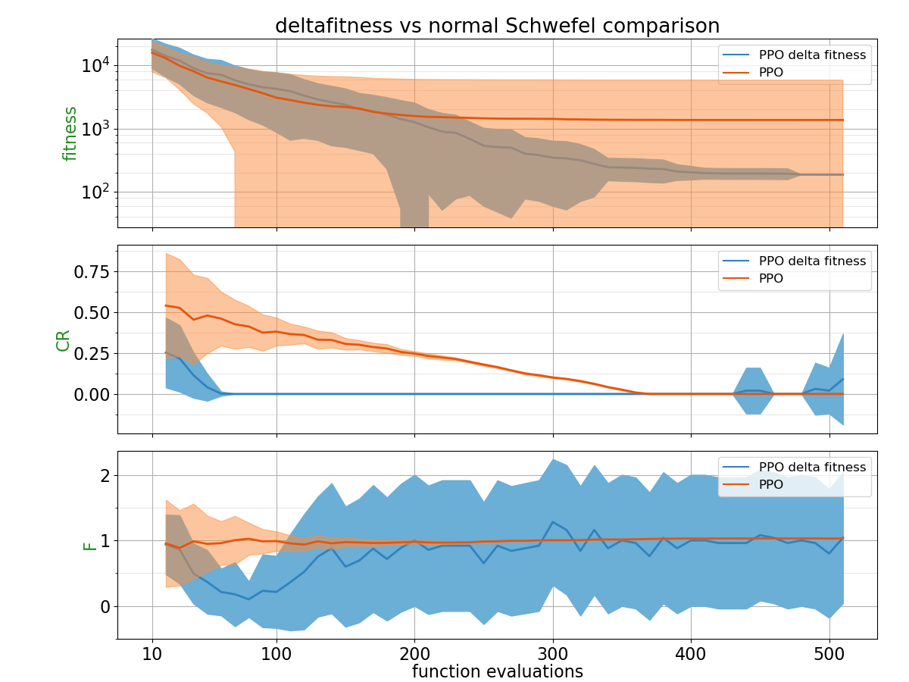
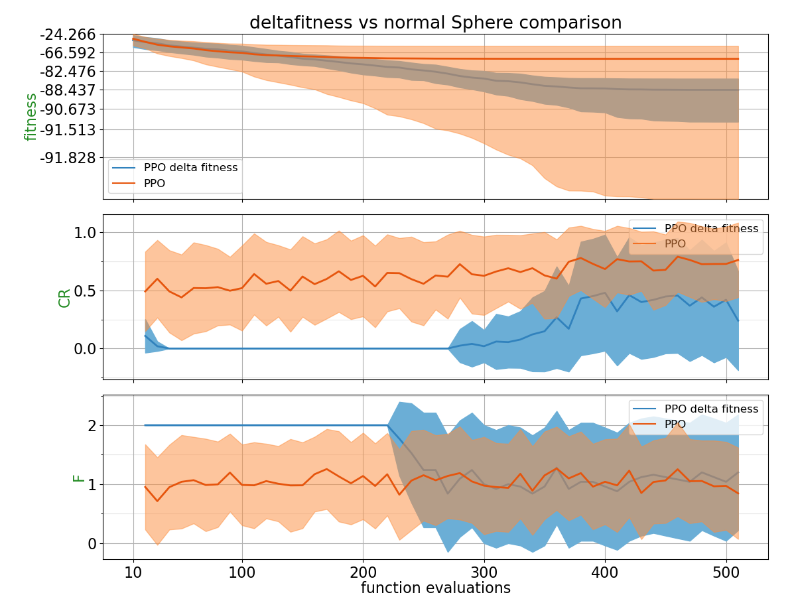
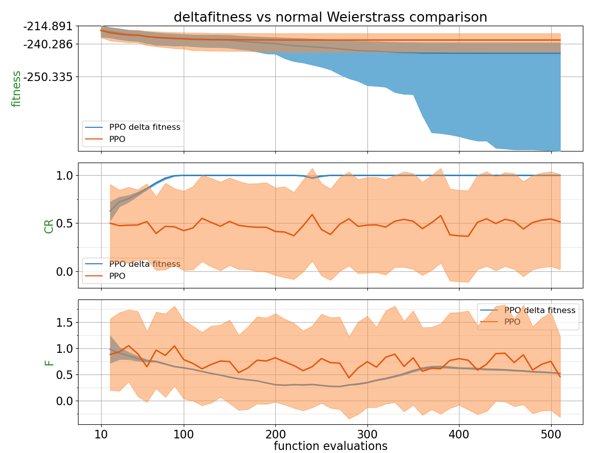

## Comparison Table

Probability of PPO trained policy outperforming CSA using 2 different metrics: Area under the curve and the absolute best of the run.
| Function    | p(PPO delta fitness < PPO) with AUC metric | p(PPO delta fitness < PPO) with best of the run metric |
| :---------- | ------------------------------ | ------------------------------- |
| BentCigar | **0.656** | **0.94** |
| Discus | 0.4868 | **0.6888** |
| Ellipsoid | **0.5764** | **0.9512** |
| Katsuura | **0.5496** | **0.5404** |
| Rastrigin | **0.7828** | **0.8548** |
| Rosenbrock | 0.4008 | **0.9584** |
| Schaffers | 0.3452 | **0.588** |
| Schwefel | 0.3776 | 0.4588 |
| Sphere | **0.5716** | **0.7936** |
| Weierstrass | **0.6936** | **0.8028** |

## Plots

##### BentCigar

##### Discus

##### Ellipsoid

##### Katsuura

##### Rastrigin

##### Rosenbrock

##### Schaffers

##### Schwefel

##### Sphere

##### Weierstrass

