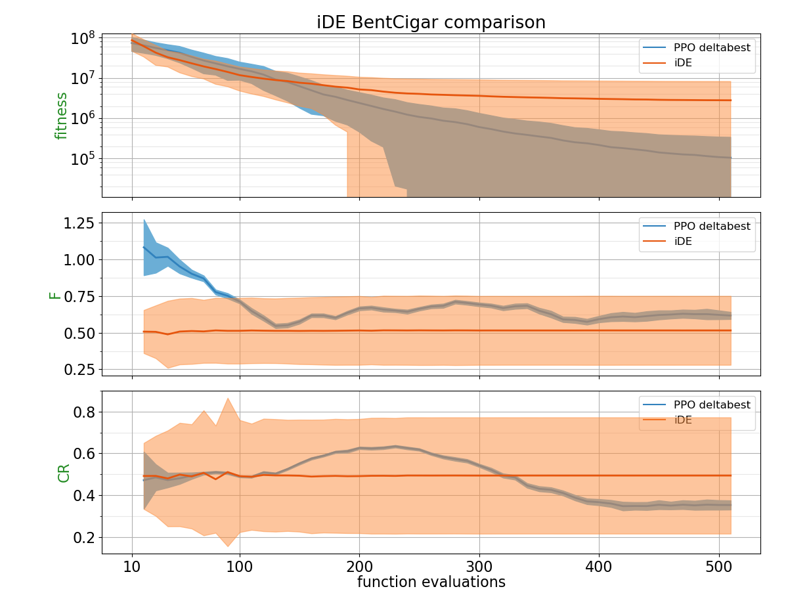
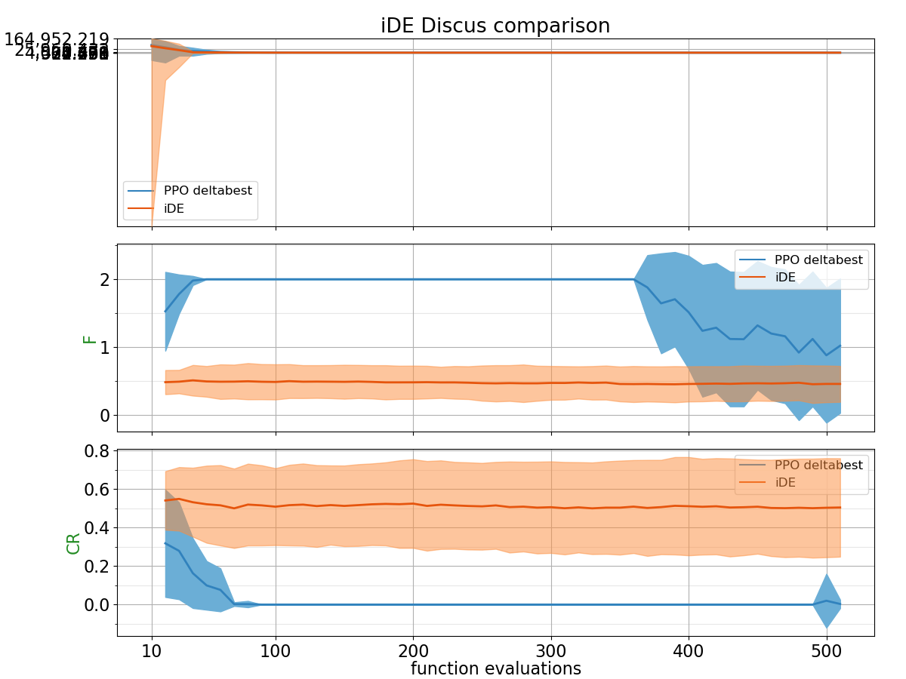
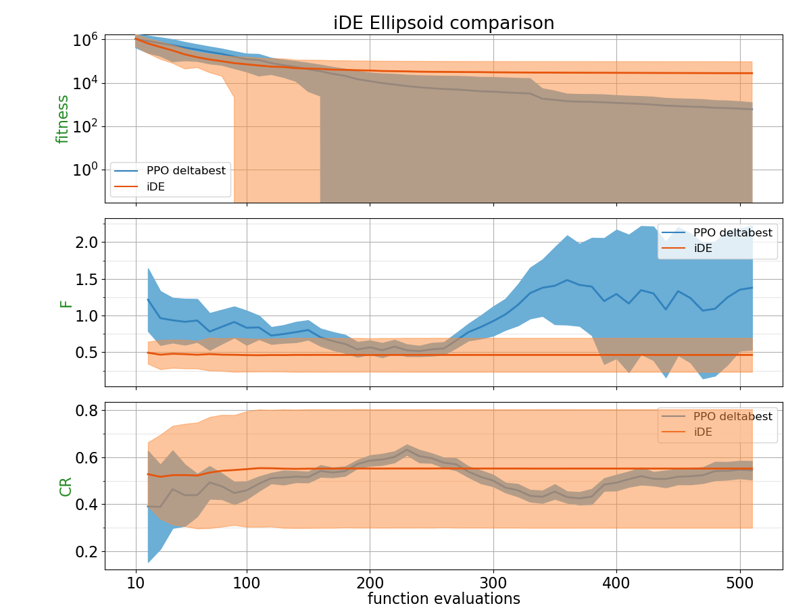
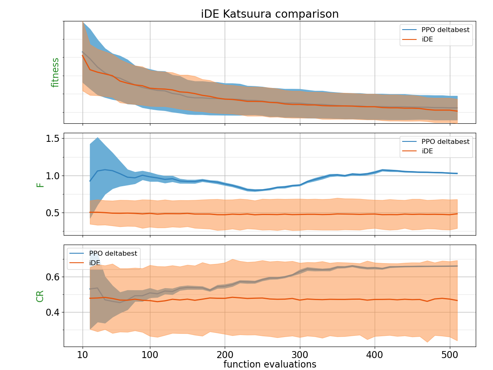
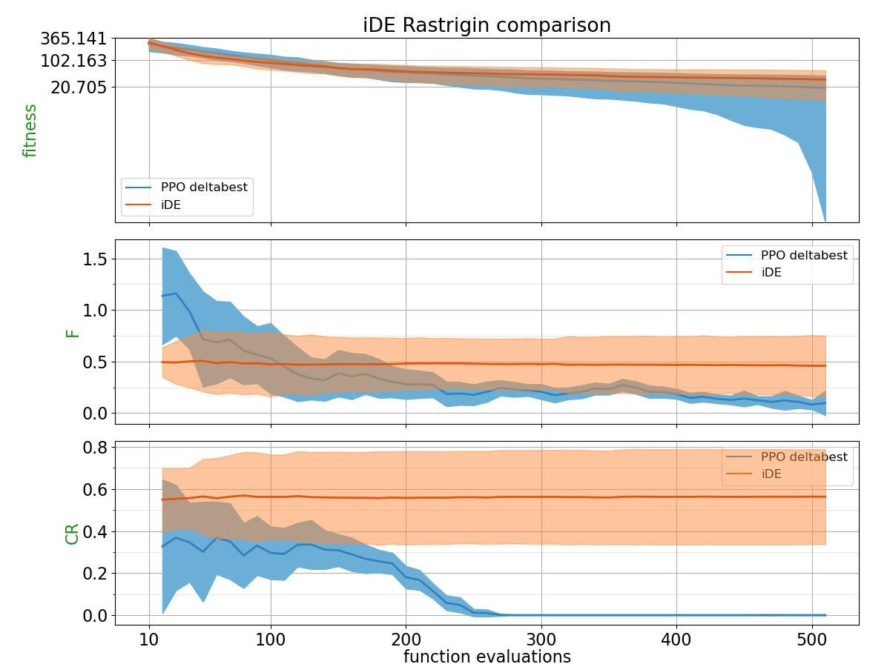
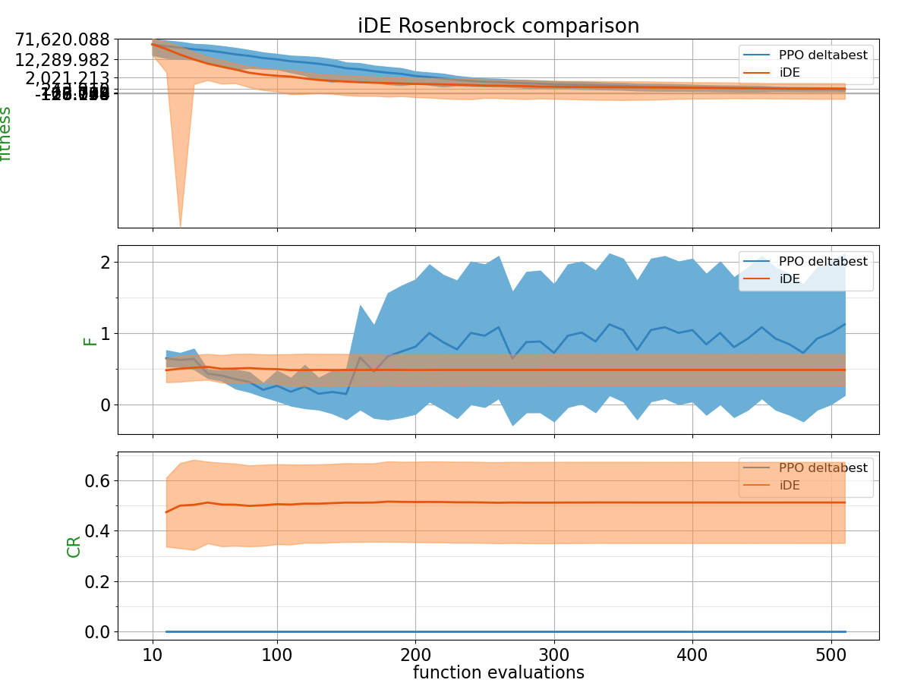
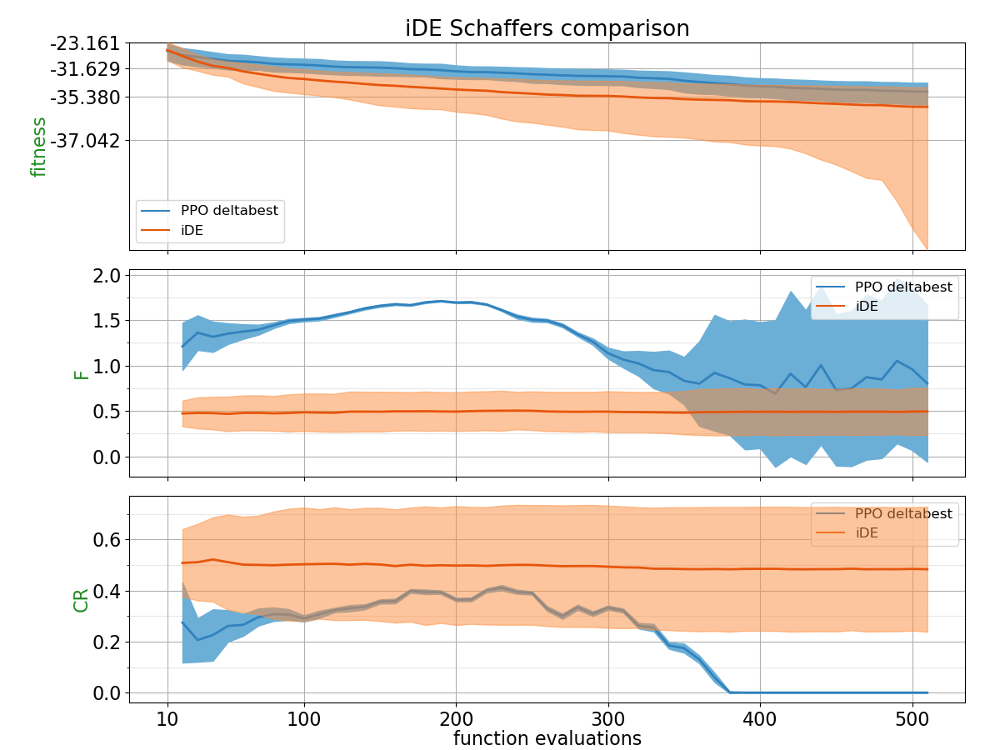
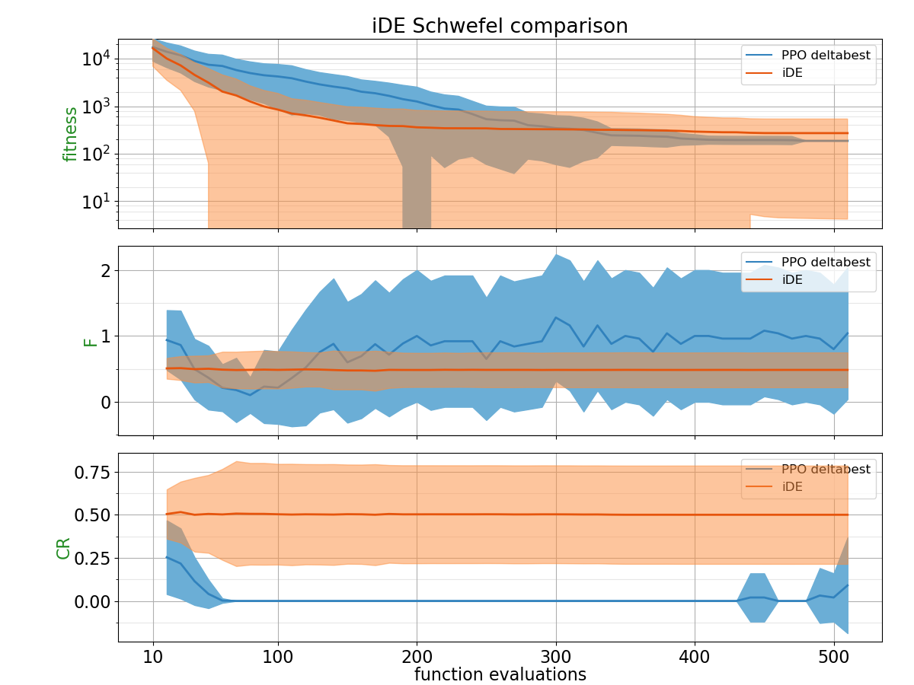
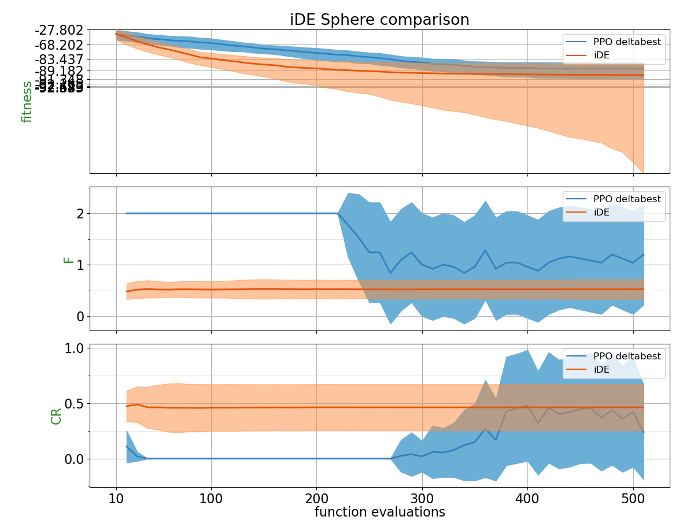
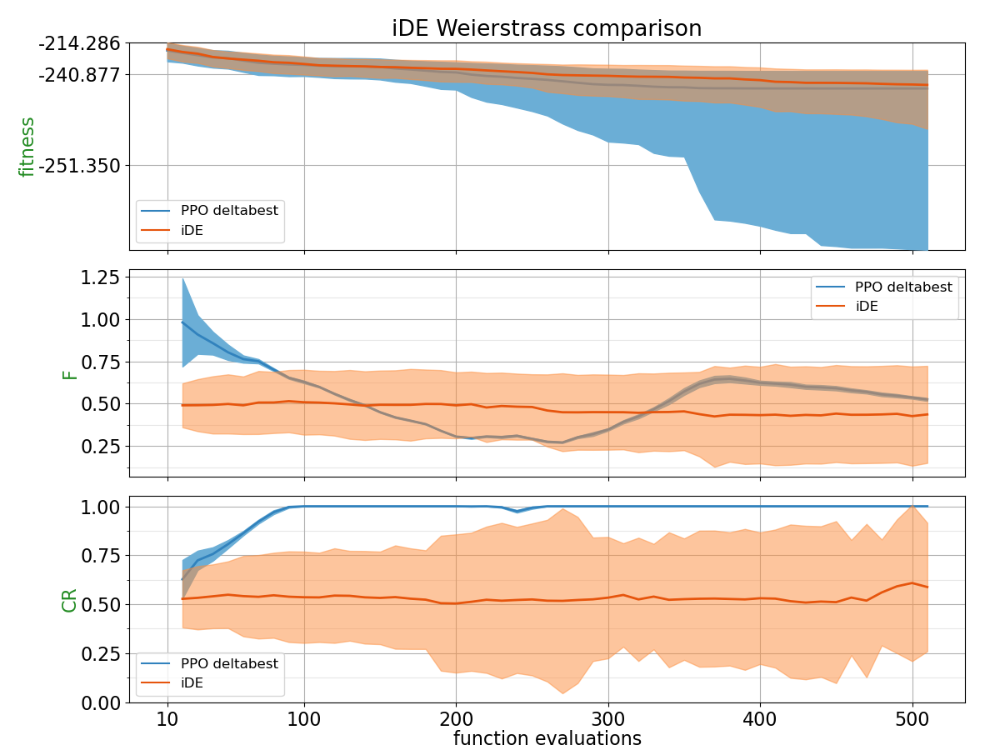

## Comparison Table

Probability of PPO trained policy outperforming CSA using 2 different metrics: Area under the curve and the absolute best of the run.
| Function    | p(PPO deltabest < iDE) with AUC metric | p(PPO deltabest < iDE) with best of the run metric |
| :---------- | ------------------------------ | ------------------------------- |
| BentCigar | 0.4824 | **0.802** |
| Discus | 0.4088 | **0.5924** |
| Ellipsoid | 0.4012 | **0.7632** |
| Katsuura | 0.474 | 0.4124 |
| Rastrigin | **0.5212** | **0.658** |
| Rosenbrock | 0.1516 | 0.3664 |
| Schaffers | 0.1224 | 0.2328 |
| Schwefel | 0.2092 | 0.3416 |
| Sphere | 0.0608 | 0.2064 |
| Weierstrass | **0.6176** | **0.568** |

## Plots

##### BentCigar

##### Discus

##### Ellipsoid

##### Katsuura

##### Rastrigin

##### Rosenbrock

##### Schaffers

##### Schwefel

##### Sphere

##### Weierstrass

