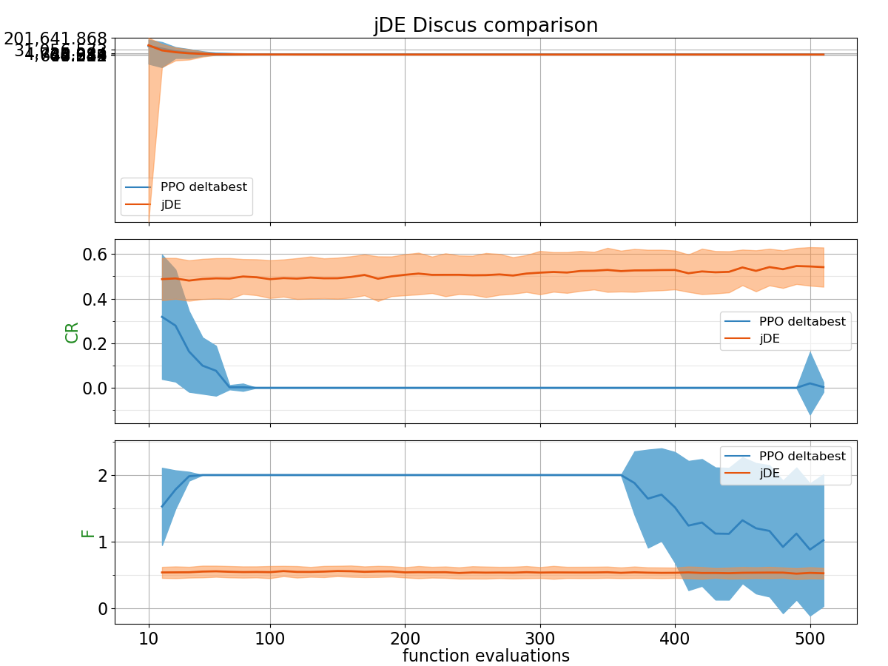
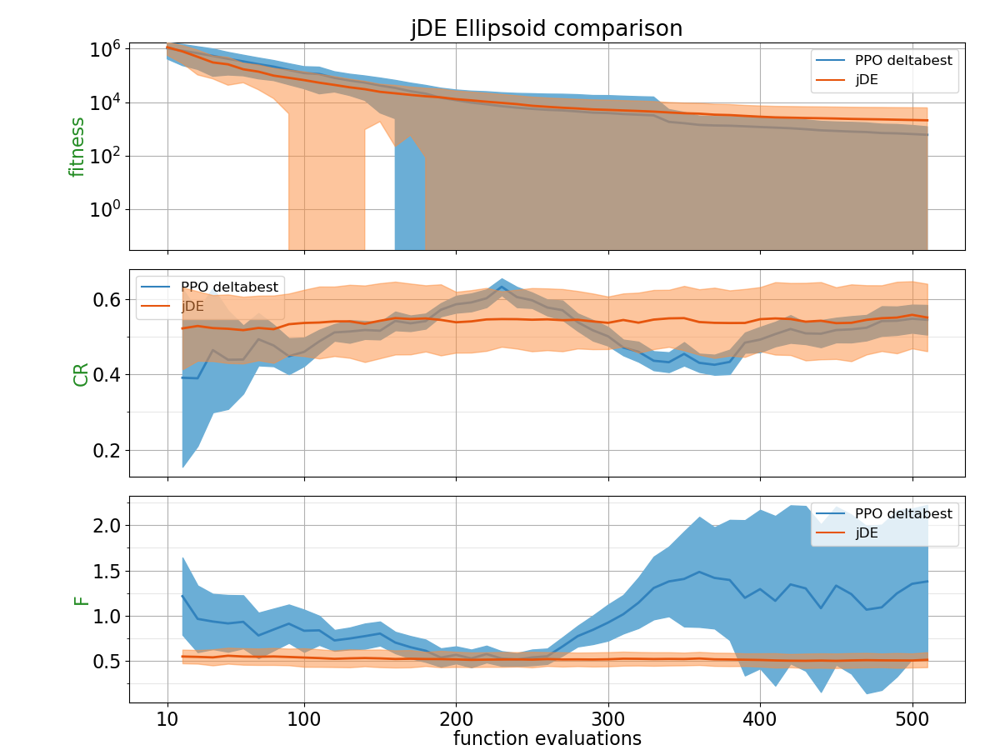
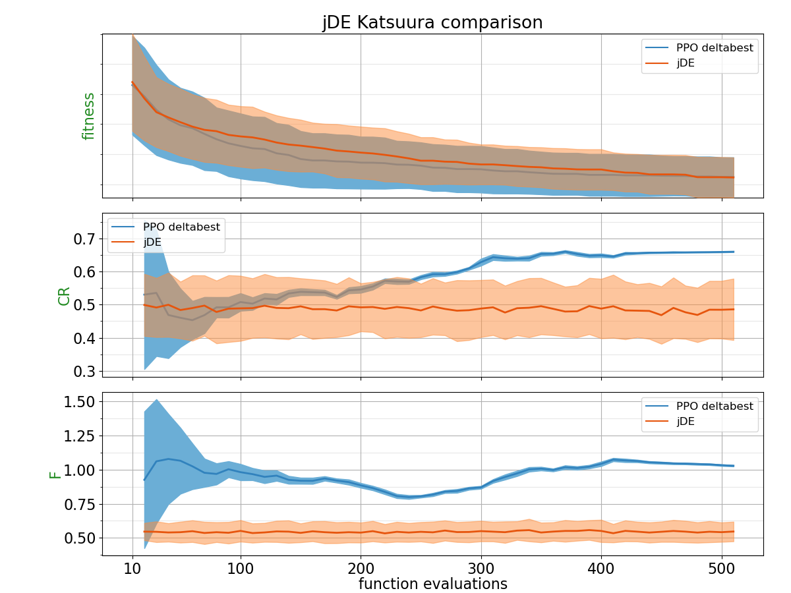
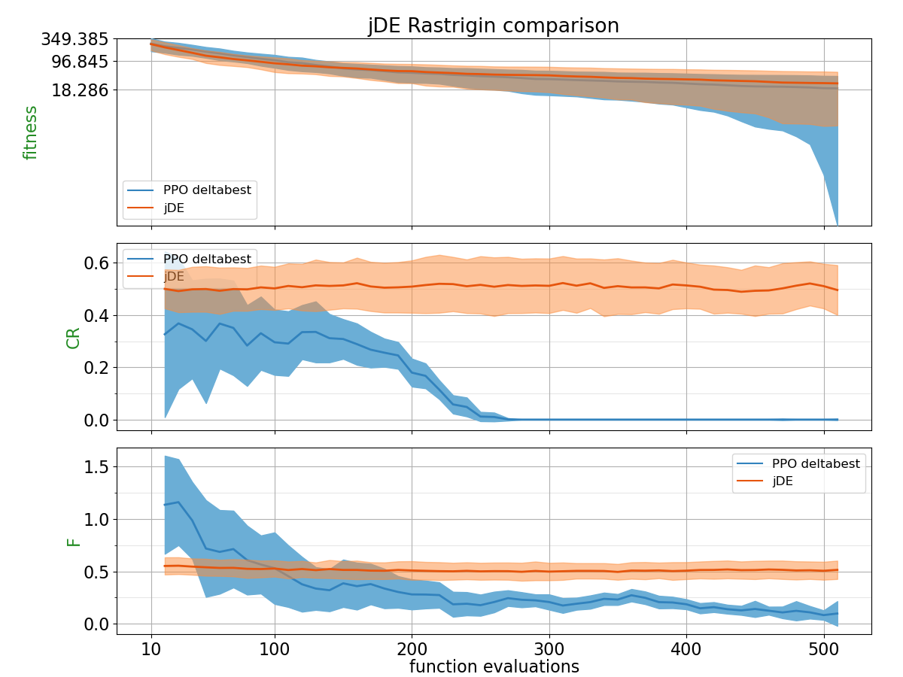
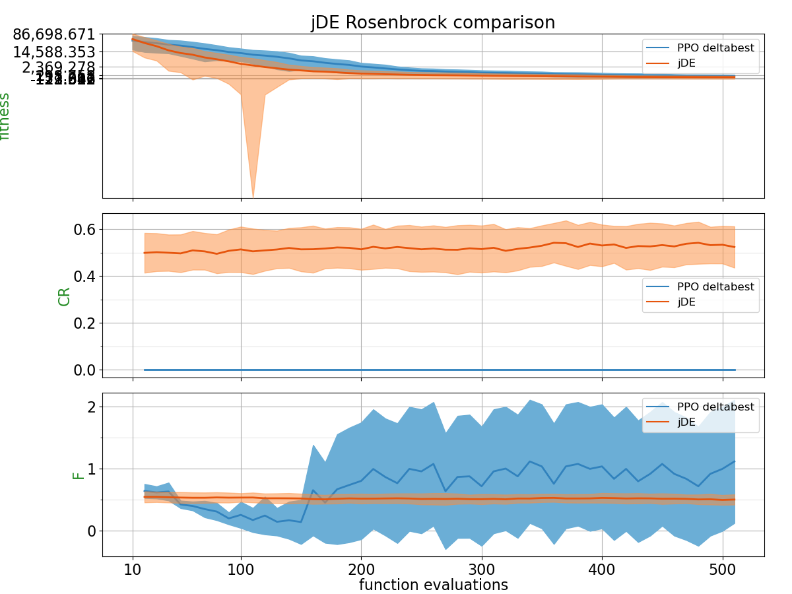
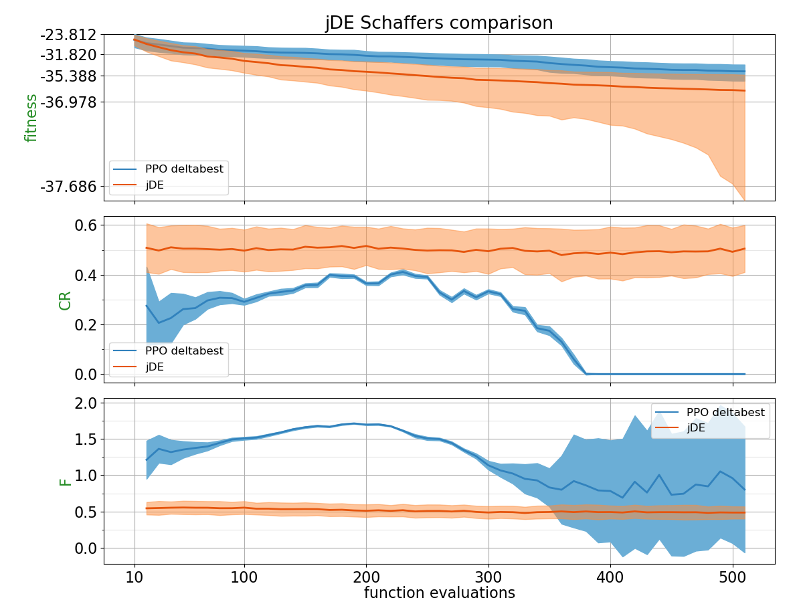
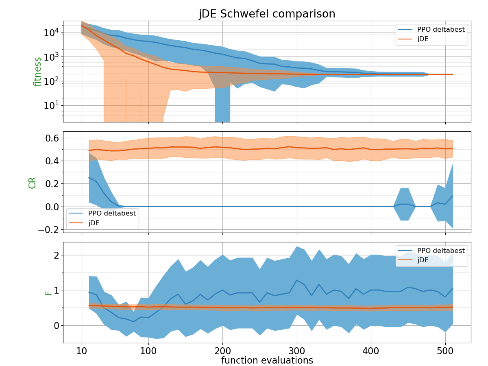
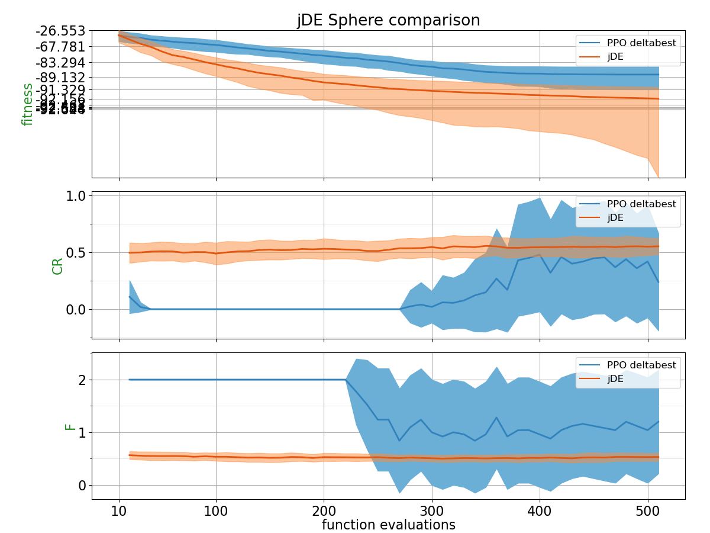
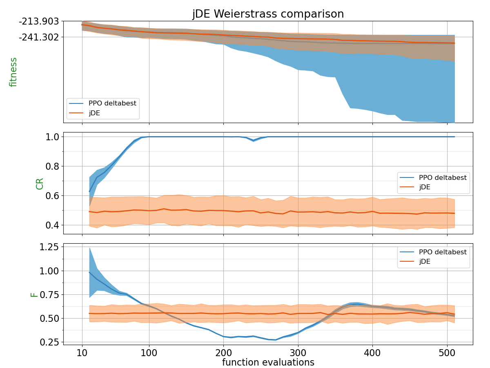

## Comparison Table

Probability of PPO trained policy outperforming CSA using 2 different metrics: Area under the curve and the absolute best of the run.
| Function    | p(PPO deltabest < jDE) with AUC metric | p(PPO deltabest < jDE) with best of the run metric |
| :---------- | ------------------------------ | ------------------------------- |
| BentCigar | 0.4372 | **0.7868** |
| Discus | 0.442 | 0.266 |
| Ellipsoid | 0.3676 | **0.5828** |
| Katsuura | **0.5956** | 0.4936 |
| Rastrigin | 0.4732 | **0.5728** |
| Rosenbrock | 0.2 | 0.1992 |
| Schaffers | 0.0896 | 0.1312 |
| Schwefel | 0.1992 | 0.0608 |
| Sphere | 0.0112 | 0.0428 |
| Weierstrass | **0.572** | **0.544** |

## Plots

##### BentCigar

##### Discus

##### Ellipsoid

##### Katsuura

##### Rastrigin

##### Rosenbrock

##### Schaffers

##### Schwefel

##### Sphere

##### Weierstrass

