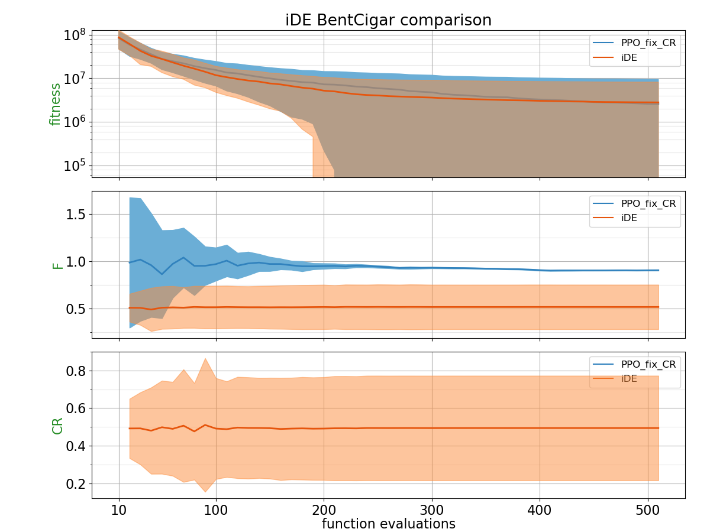
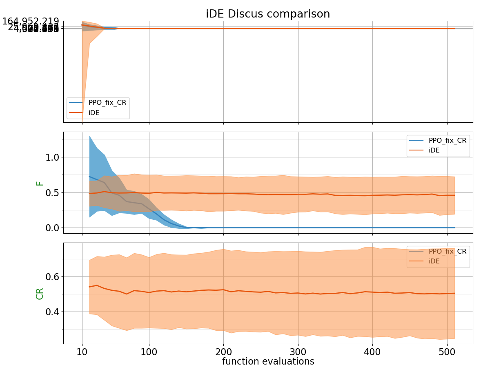
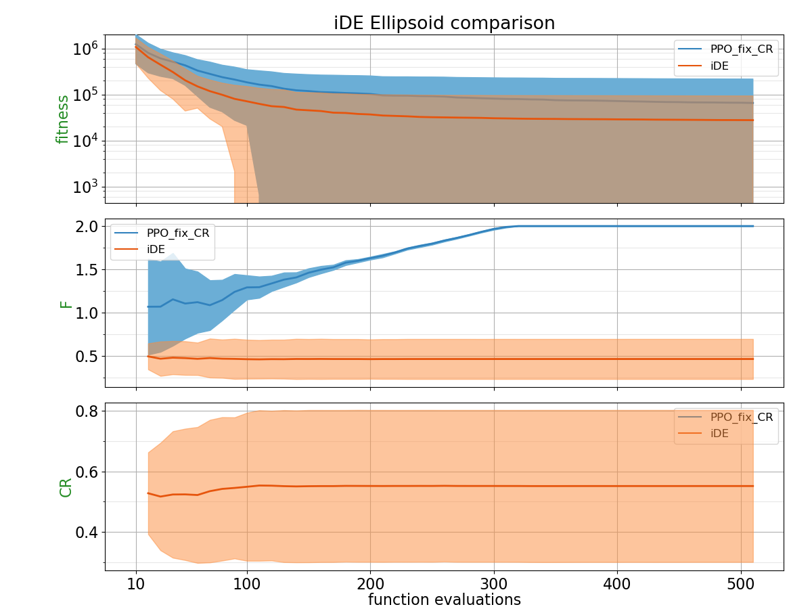
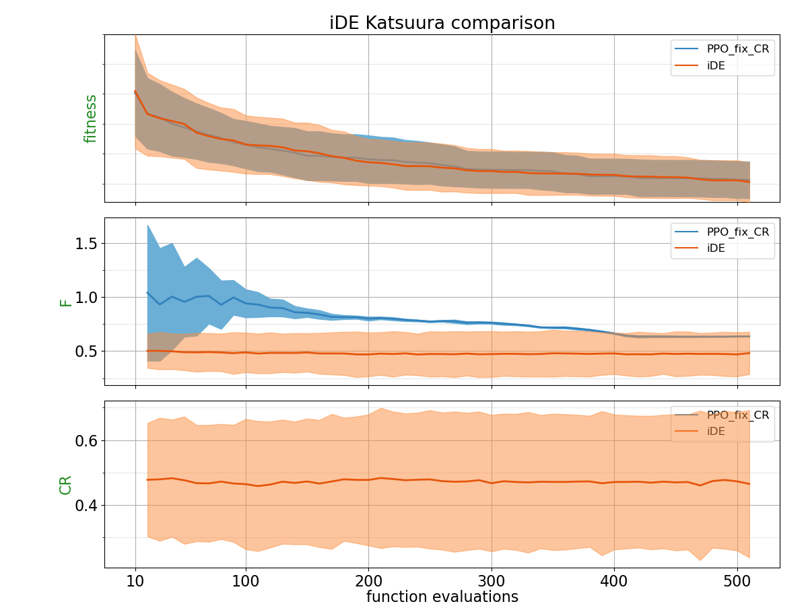
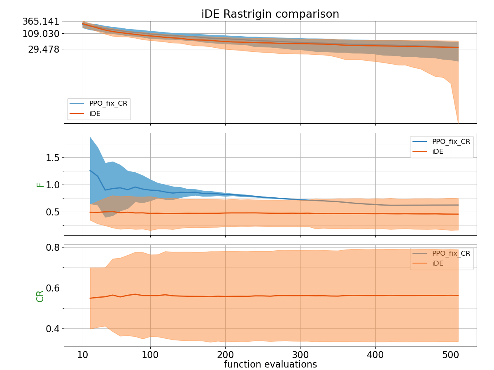
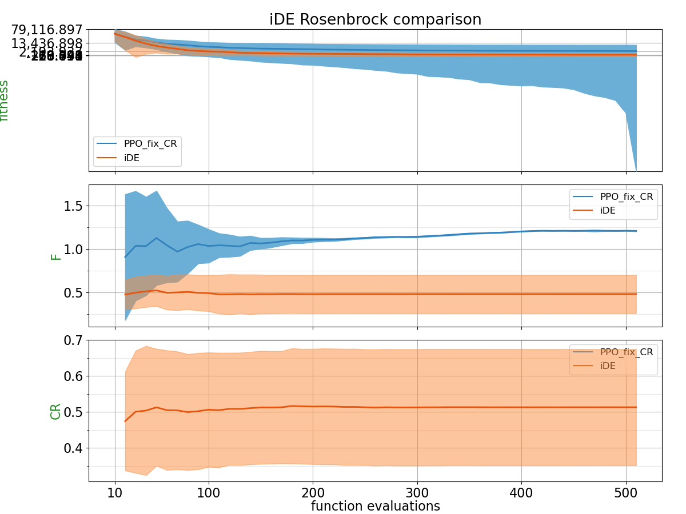
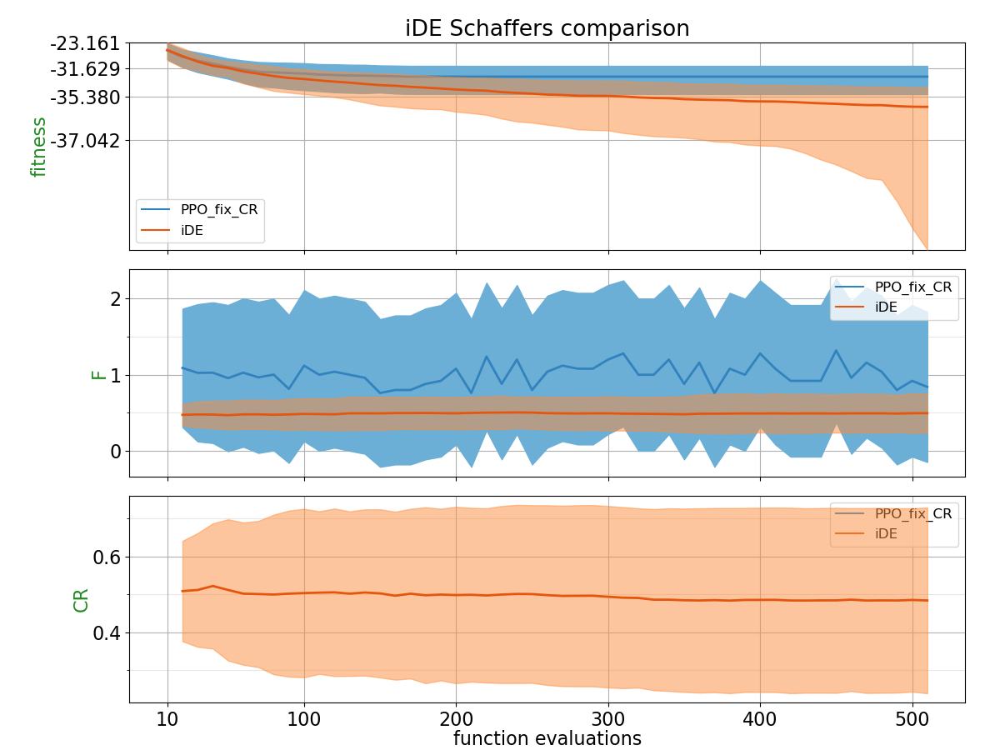
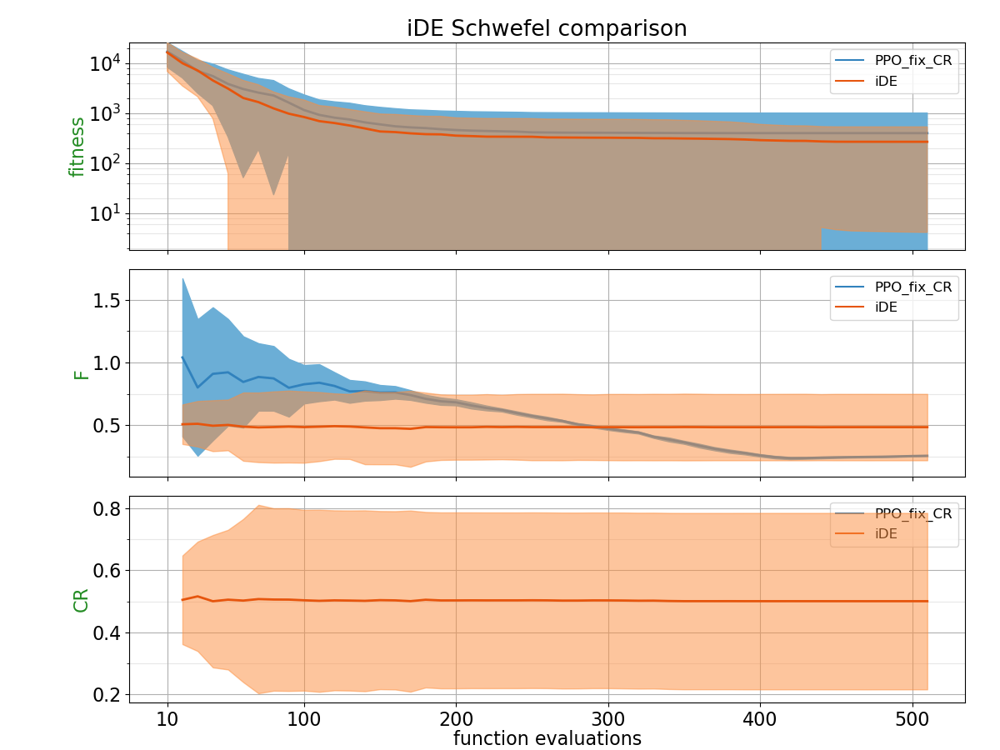
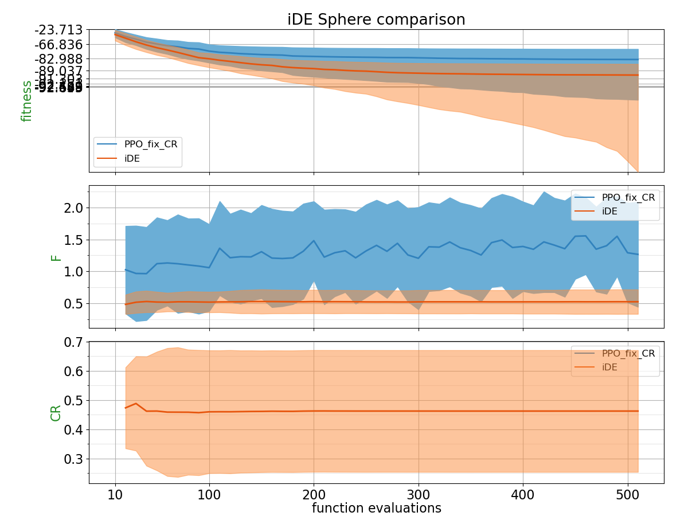
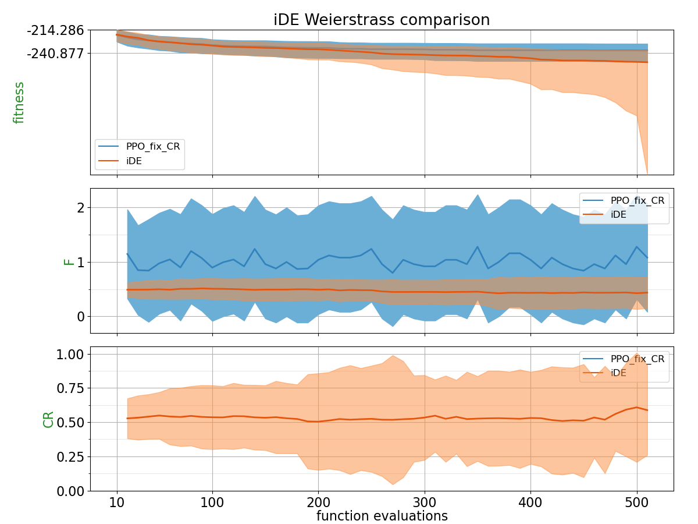

## Comparison Table

Probability of PPO trained policy outperforming CSA using 2 different metrics: Area under the curve and the absolute best of the run.
| Function    | p(PPO_fix_CR < iDE) with AUC metric | p(PPO_fix_CR < iDE) with best of the run metric |
| :---------- | ------------------------------ | ------------------------------- |
| BentCigar | 0.4508 | 0.4512 |
| Discus | 0.436 | 0.4816 |
| Ellipsoid | 0.248 | 0.1876 |
| Katsuura | 0.4828 | 0.4588 |
| Rastrigin | 0.34 | 0.4592 |
| Rosenbrock | 0.2768 | 0.2396 |
| Schaffers | 0.2228 | 0.1096 |
| Schwefel | 0.4064 | **0.5028** |
| Sphere | 0.1644 | 0.1584 |
| Weierstrass | 0.3496 | 0.2572 |

## Plots

**for PPO, CR is fixed to 0.7**

##### BentCigar

##### Discus

##### Ellipsoid

##### Katsuura

##### Rastrigin

##### Rosenbrock

##### Schaffers

##### Schwefel

##### Sphere

##### Weierstrass

