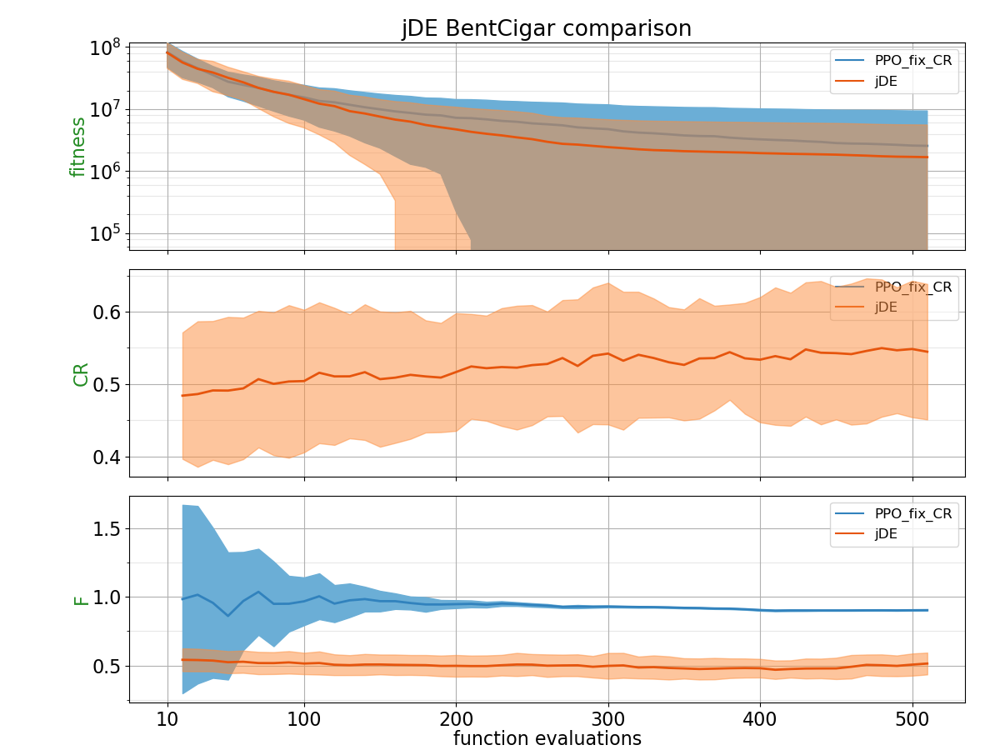
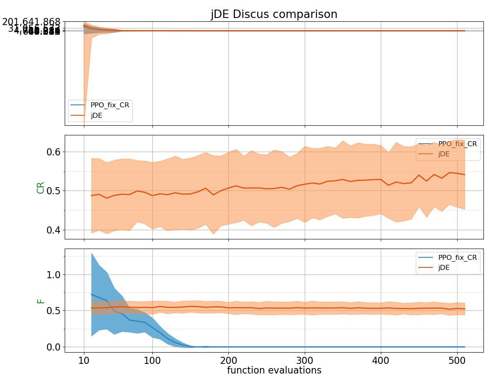
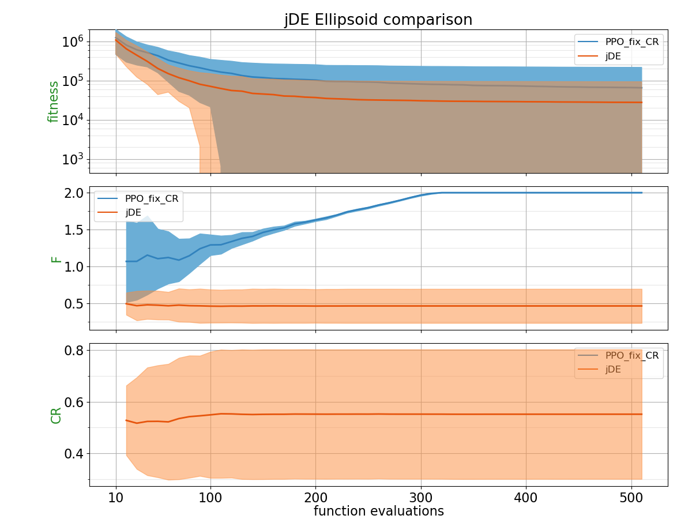
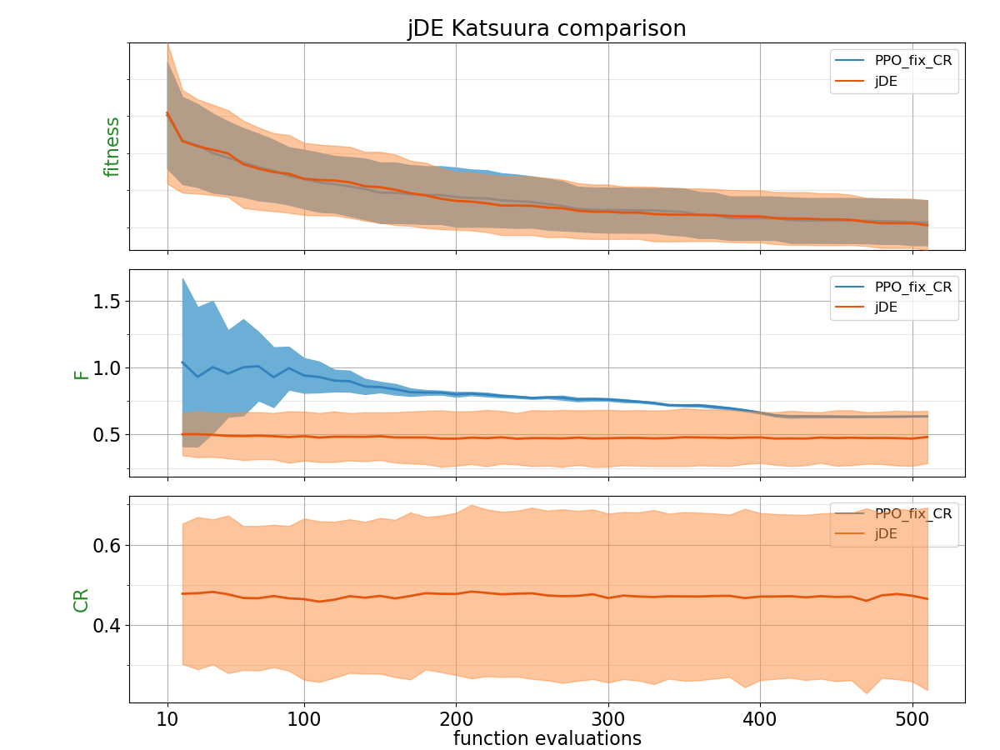
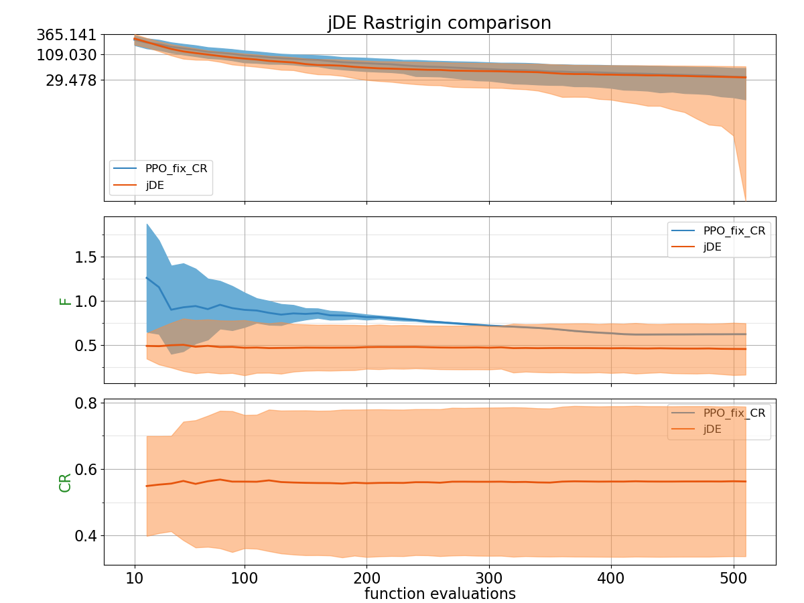
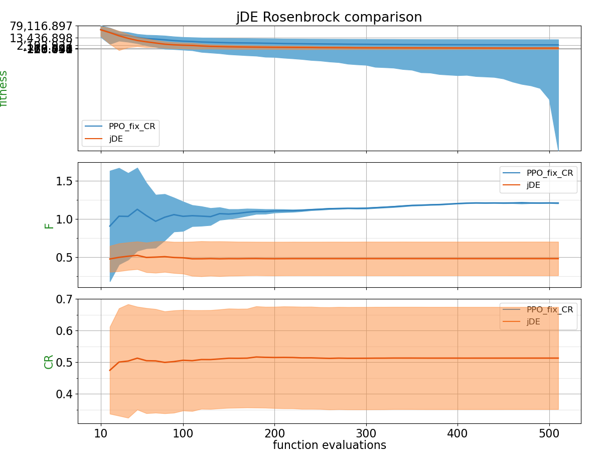
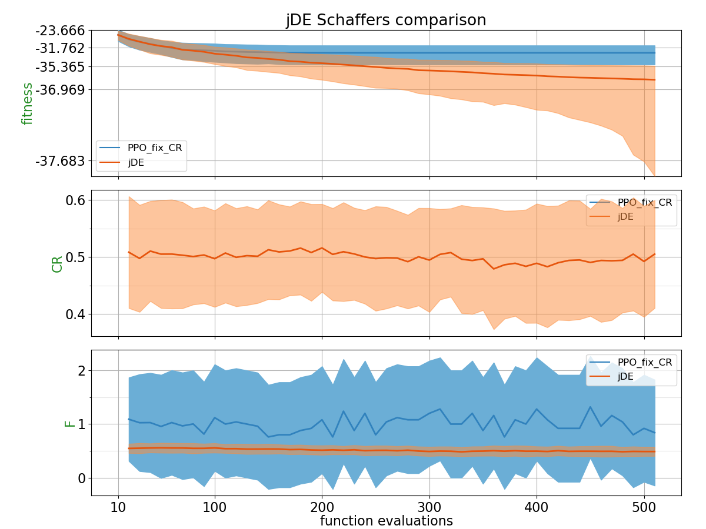
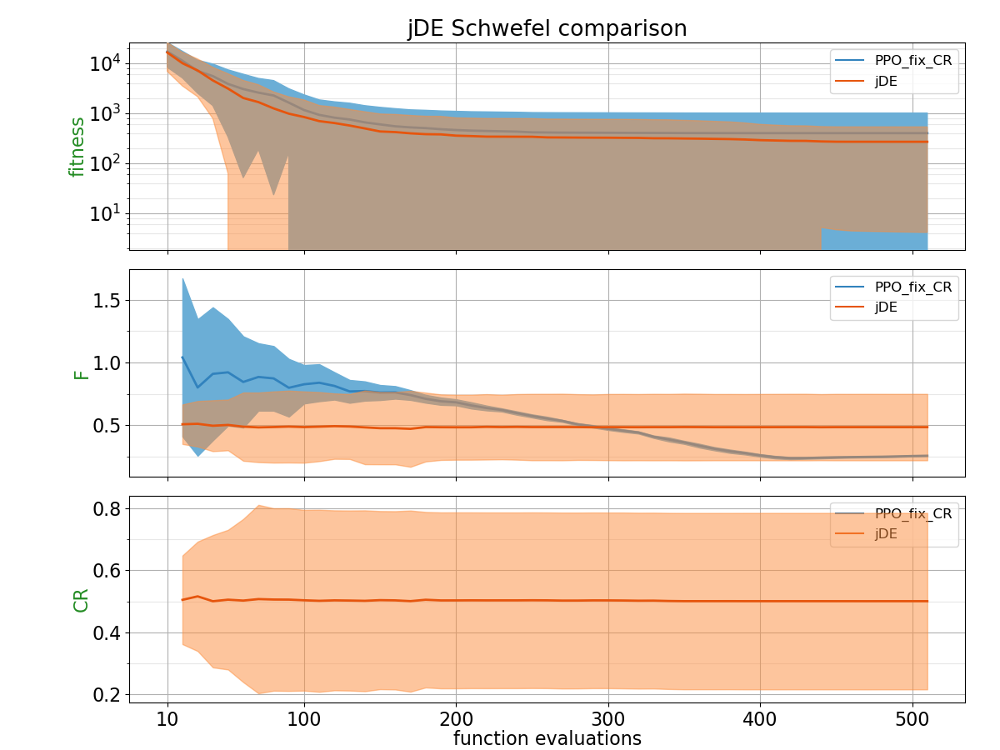
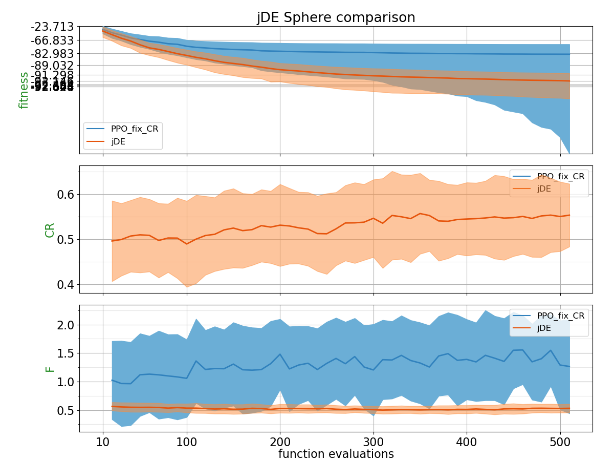
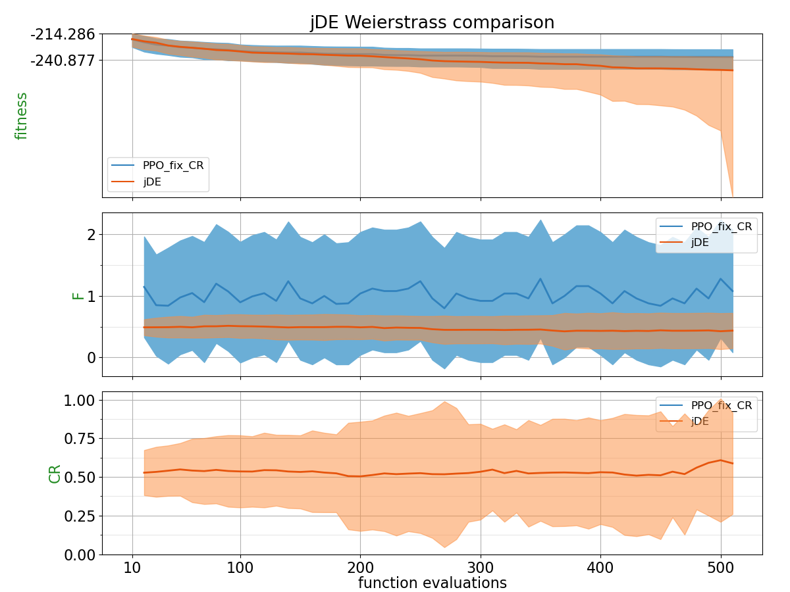

## Comparison Table

Probability of PPO trained policy outperforming CSA using 2 different metrics: Area under the curve and the absolute best of the run.
| Function    | p(PPO_fix_CR < jDE) with AUC metric | p(PPO_fix_CR < jDE) with best of the run metric |
| :---------- | ------------------------------ | ------------------------------- |
| BentCigar | 0.4136 | 0.4128 |
| Discus | 0.4712 | 0.1844 |
| Ellipsoid | 0.2084 | 0.0228 |
| Katsuura | **0.6164** | **0.5404** |
| Rastrigin | 0.328 | 0.384 |
| Rosenbrock | 0.3388 | 0.1208 |
| Schaffers | 0.1764 | 0.0572 |
| Schwefel | 0.396 | 0.226 |
| Sphere | 0.088 | 0.0352 |
| Weierstrass | 0.314 | 0.1992 |

## Plots

**for PPO, CR is fixed to 0.7**

##### BentCigar

##### Discus

##### Ellipsoid

##### Katsuura

##### Rastrigin

##### Rosenbrock

##### Schaffers

##### Schwefel

##### Sphere

##### Weierstrass

