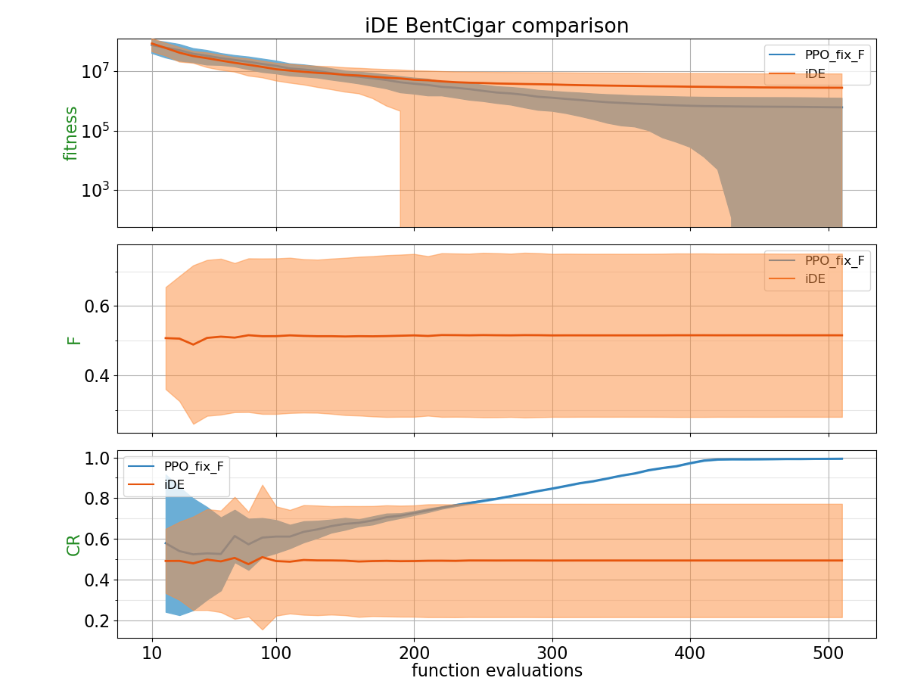
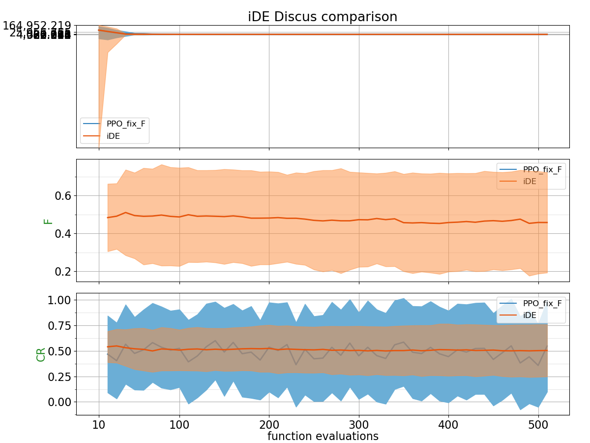
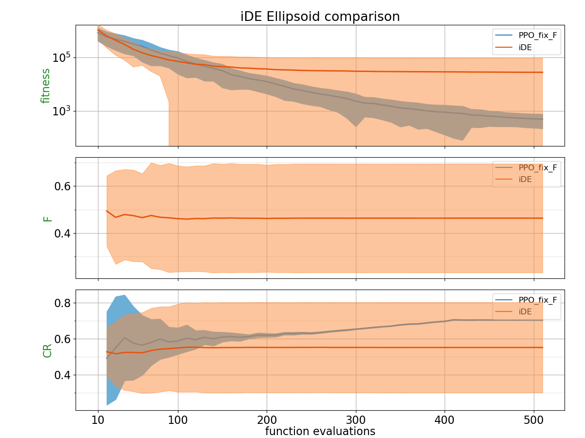
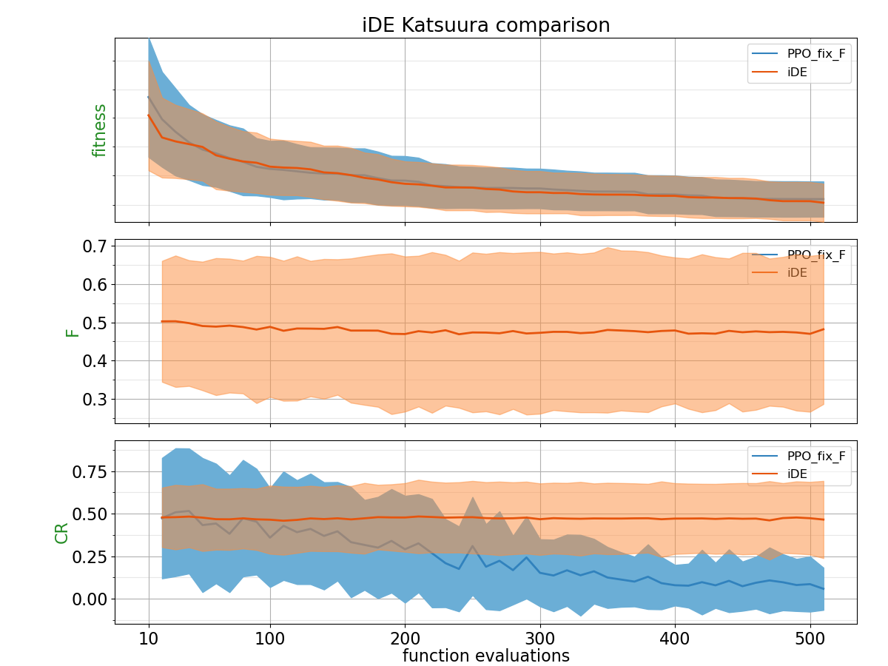
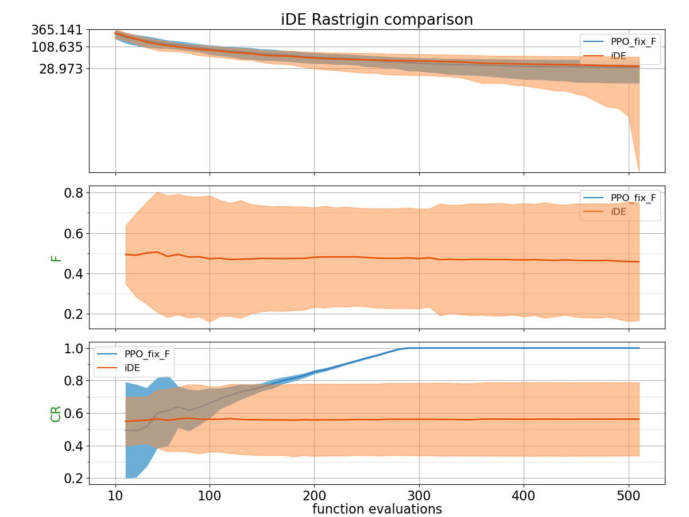
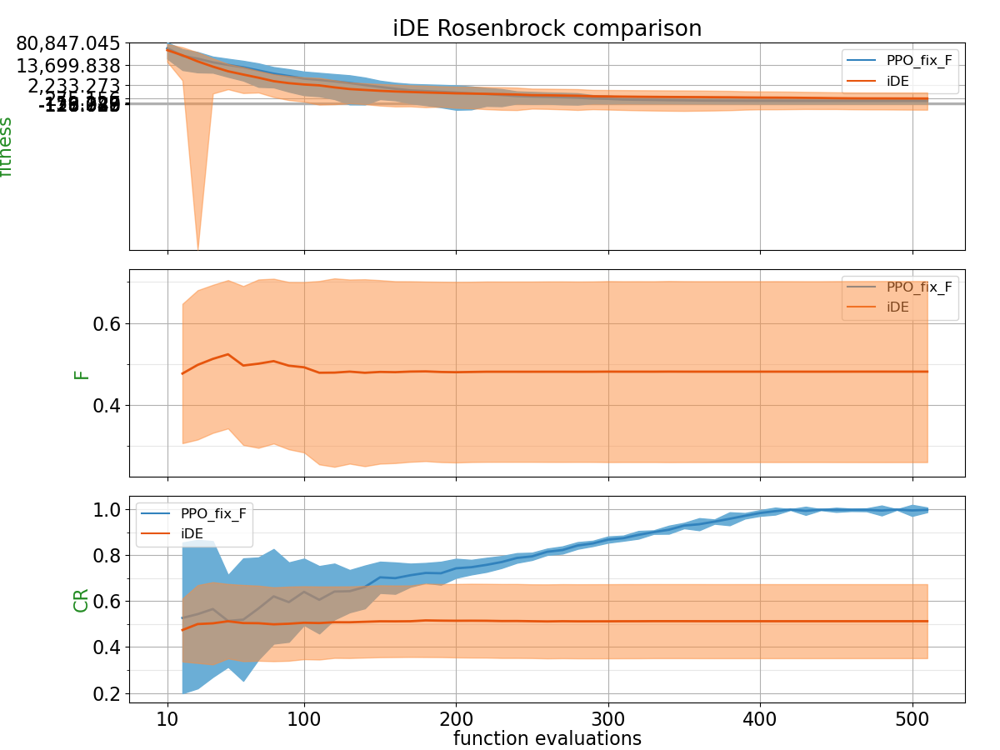
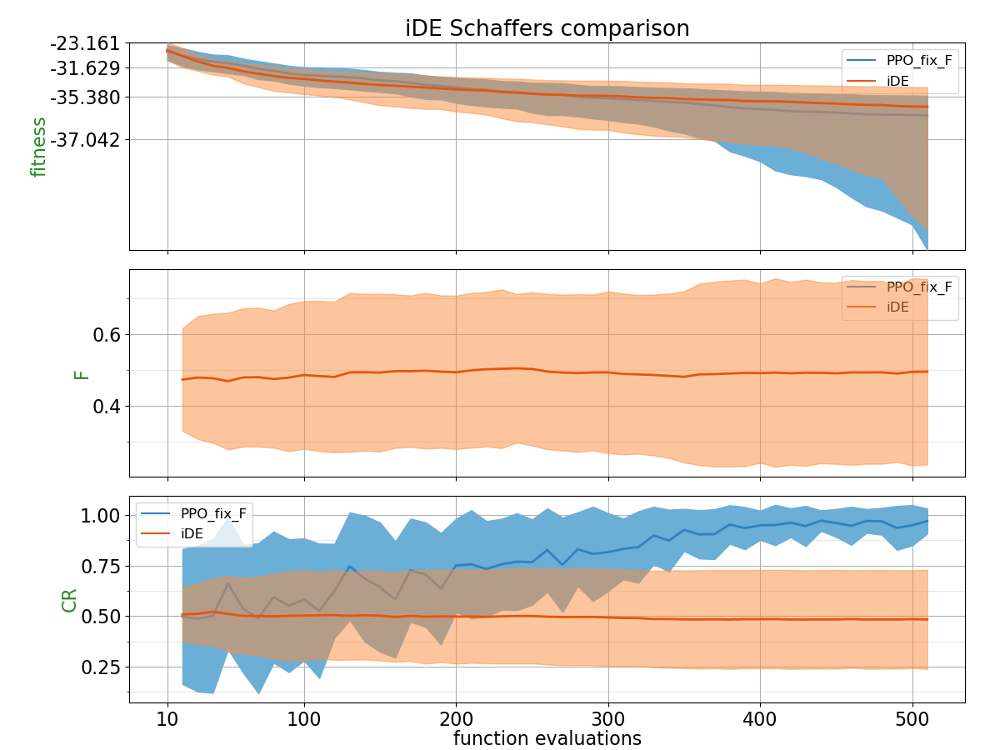
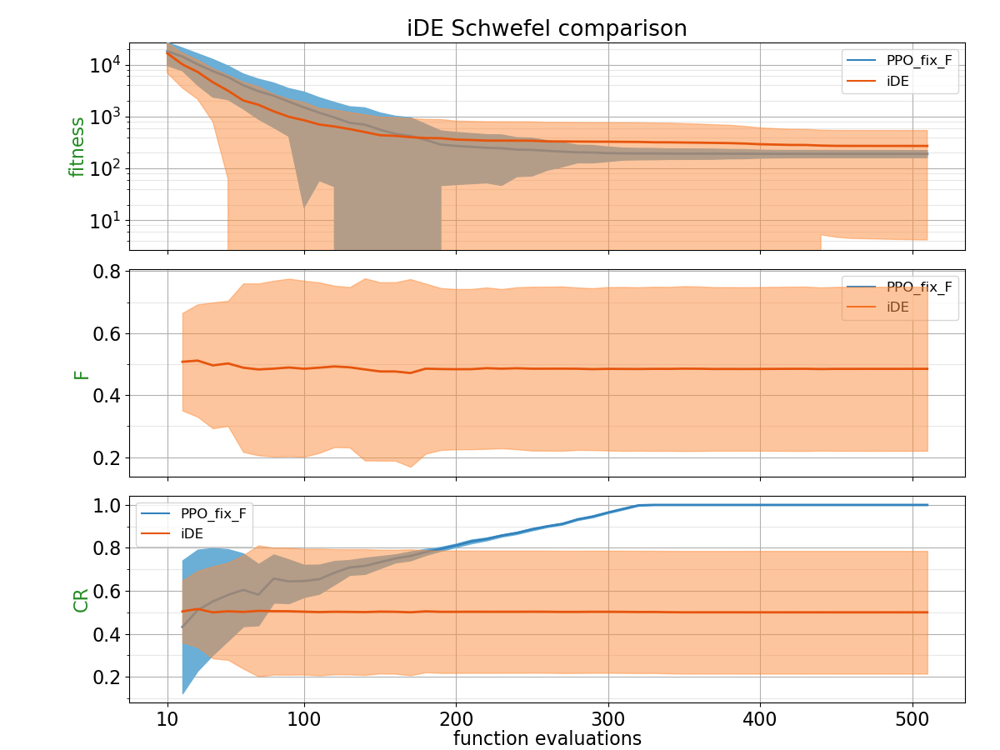
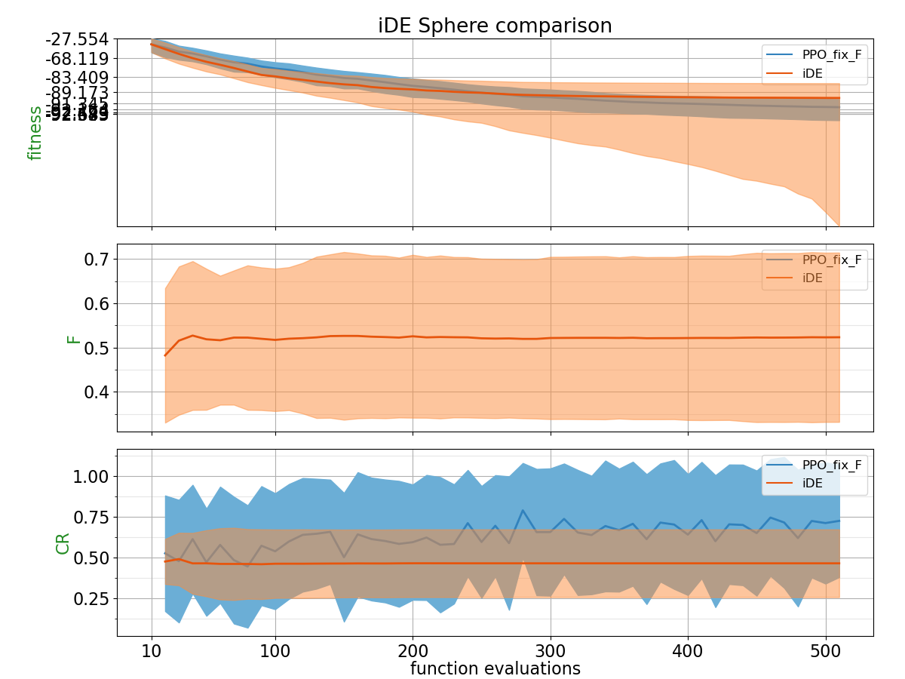
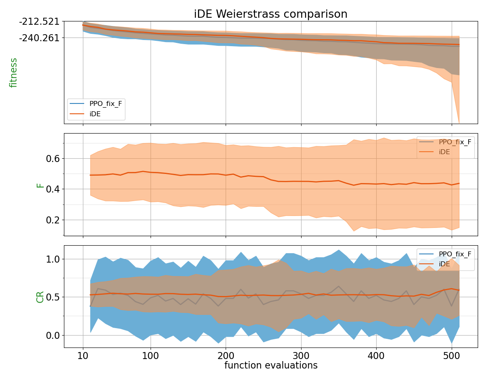

## Comparison Table

Probability of PPO trained policy outperforming CSA using 2 different metrics: Area under the curve and the absolute best of the run.

| Function    | p(PPO_fix_F < iDE) with AUC metric | p(PPO_fix_F < iDE) with best of the run metric |
| :---------- | ------------------------------ | ------------------------------- |
| BentCigar | **0.504** | 0.4728 |
| Discus | 0.4212 | **0.7684** |
| Ellipsoid | **0.5044** | **0.8044** |
| Katsuura | 0.4484 | 0.4272 |
| Rastrigin | 0.4344 | 0.4724 |
| Rosenbrock | 0.3564 | **0.5164** |
| Schaffers | 0.45 | **0.5764** |
| Schwefel | 0.3104 | 0.3996 |
| Sphere | 0.356 | 0.47 |
| Weierstrass | **0.5668** | **0.5744** |

## Plots

**for PPO, F is fixed to 0.8**

##### BentCigar

##### Discus

##### Ellipsoid

##### Katsuura

##### Rastrigin

##### Rosenbrock

##### Schaffers

##### Schwefel

##### Sphere

##### Weierstrass

