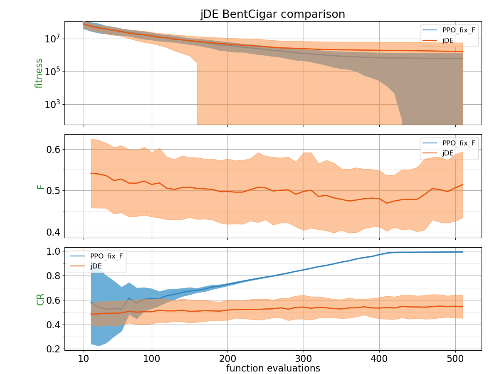
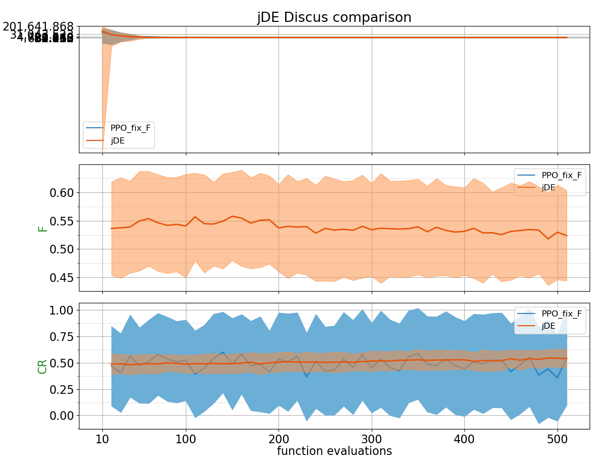
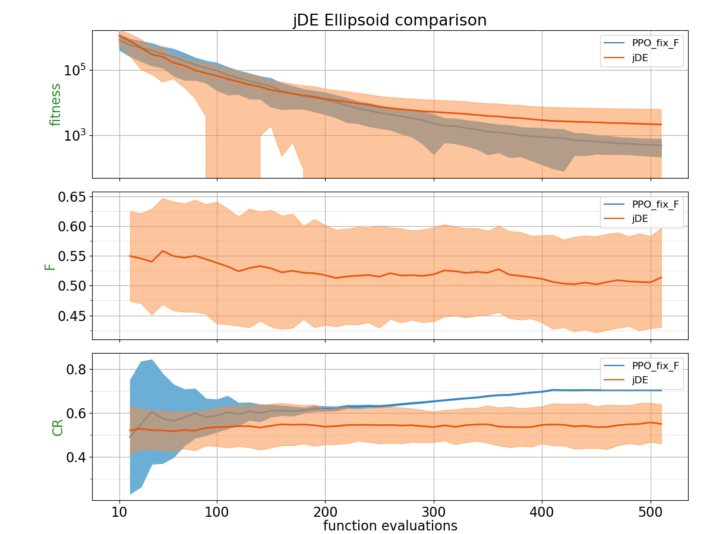
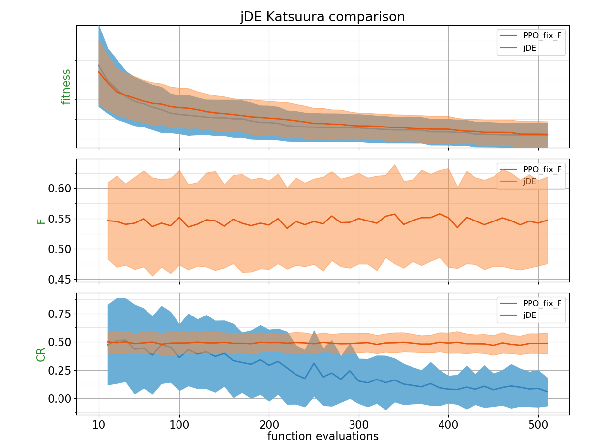
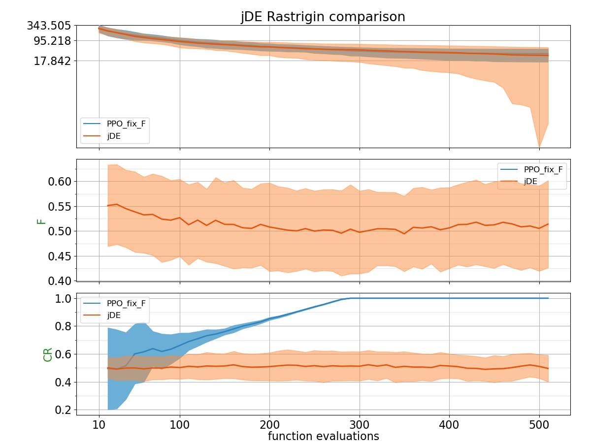
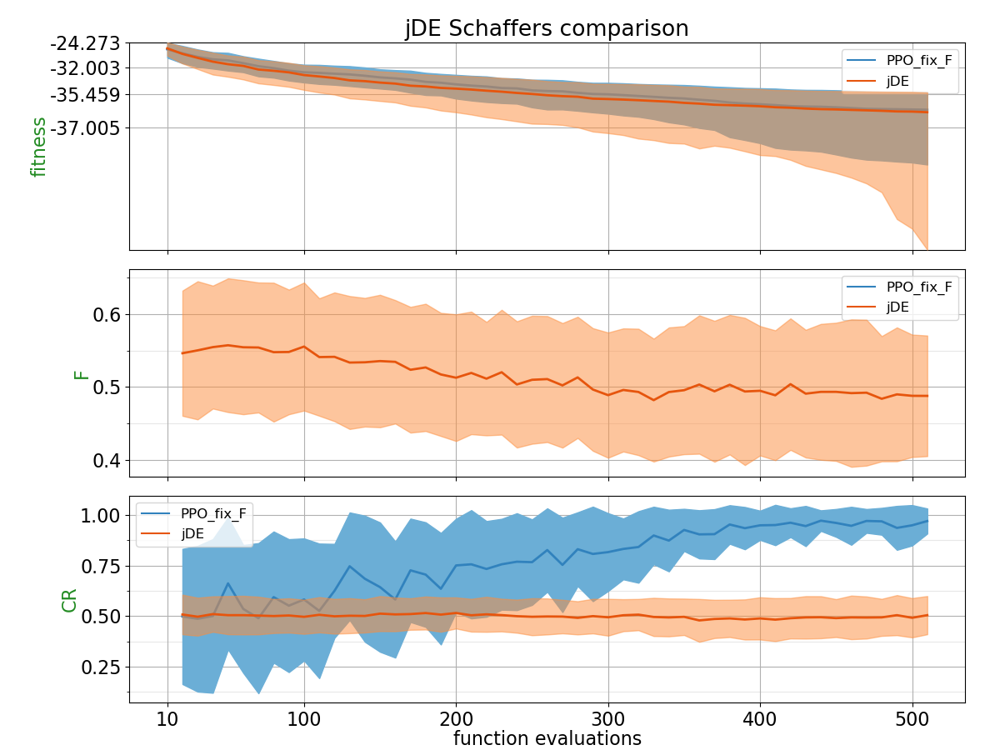
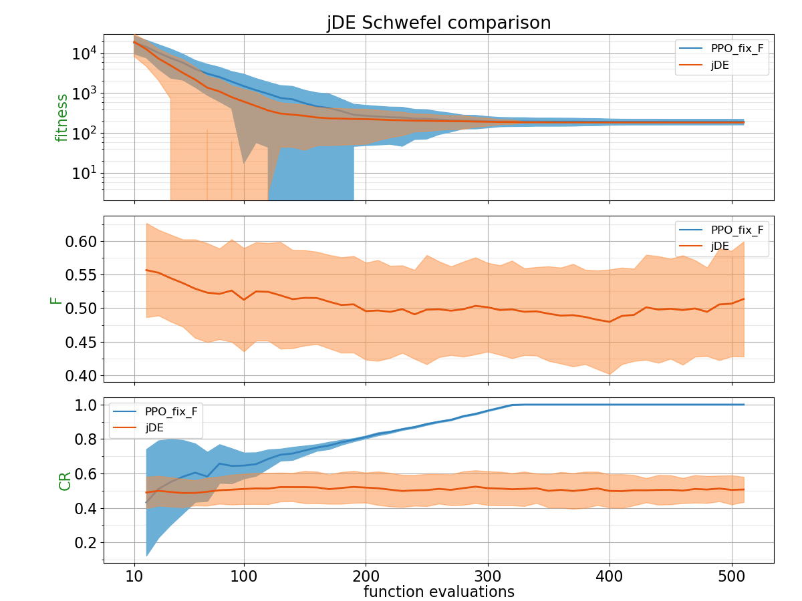
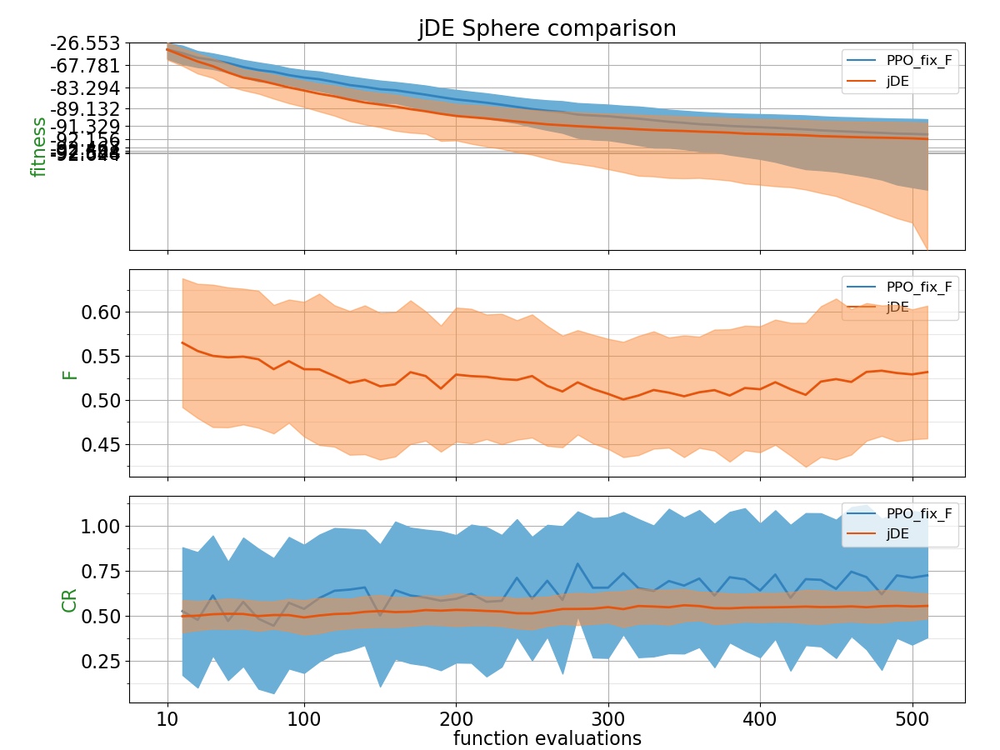
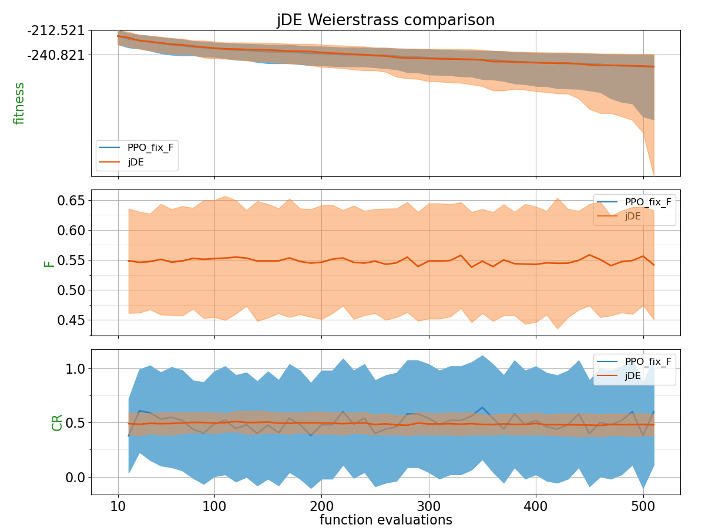

## Comparison Table

Probability of PPO trained policy outperforming CSA using 2 different metrics: Area under the curve and the absolute best of the run.
| Function    | p(PPO_fix_F < jDE) with AUC metric | p(PPO_fix_F < jDE) with best of the run metric |
| :---------- | ------------------------------ | ------------------------------- |
| BentCigar | 0.4632 | 0.4664 |
| Discus | 0.4544 | 0.4696 |
| Ellipsoid | 0.4808 | **0.636** |
| Katsuura | **0.5664** | **0.5164** |
| Rastrigin | 0.4072 | 0.3956 |
| Rosenbrock | 0.442 | 0.4088 |
| Schaffers | 0.384 | 0.4648 |
| Schwefel | 0.2952 | 0.0892 |
| Sphere | 0.1984 | 0.3108 |
| Weierstrass | **0.5256** | **0.5304** |

## Plots

**for PPO, F is fixed to 0.8**

##### BentCigar

##### Discus

##### Ellipsoid

##### Katsuura

##### Rastrigin

##### Rosenbrock

##### Schaffers

##### Schwefel

##### Sphere

##### Weierstrass

