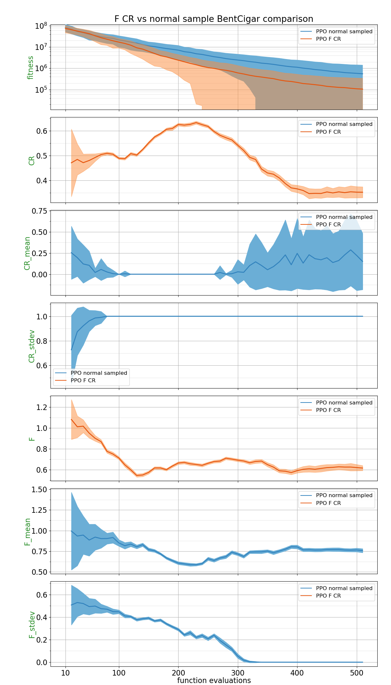
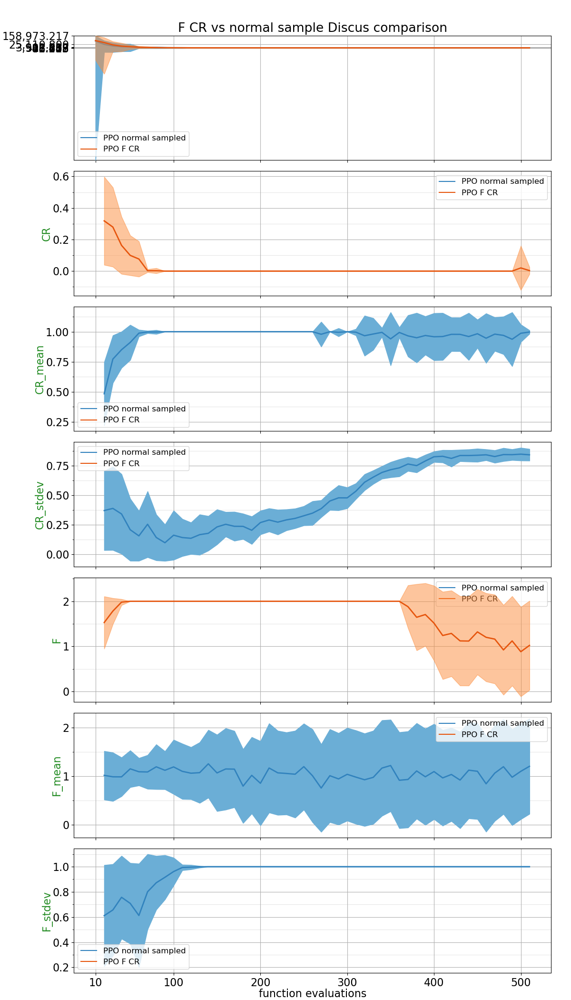
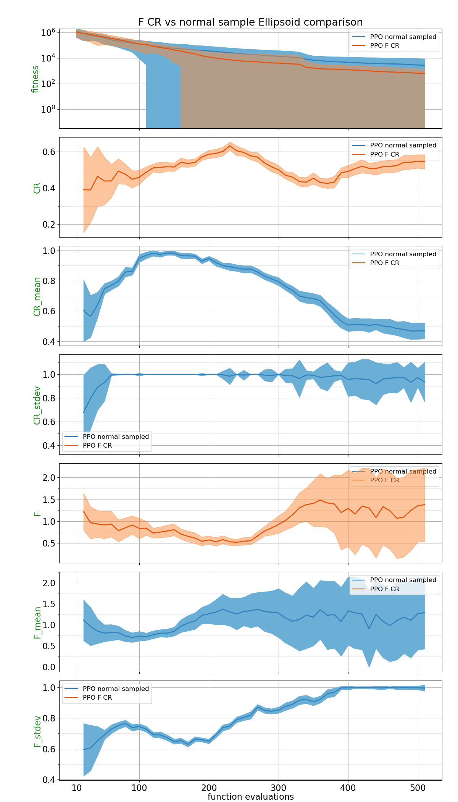
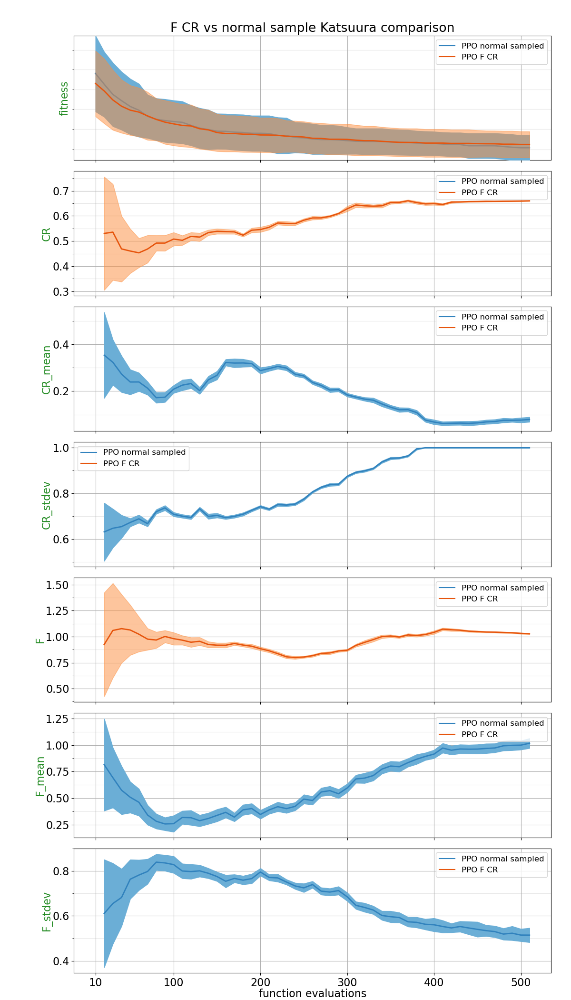
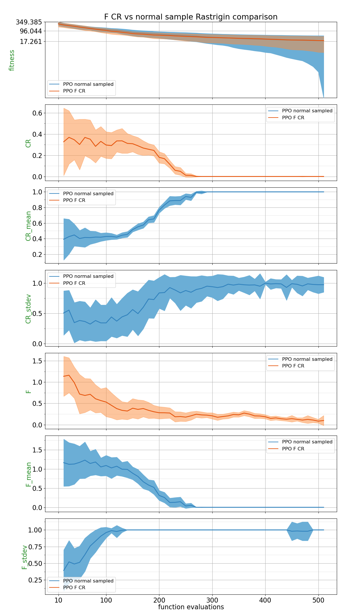
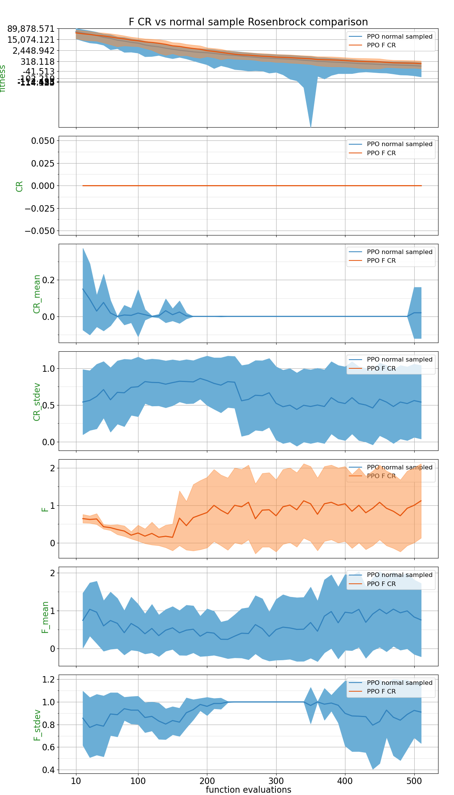
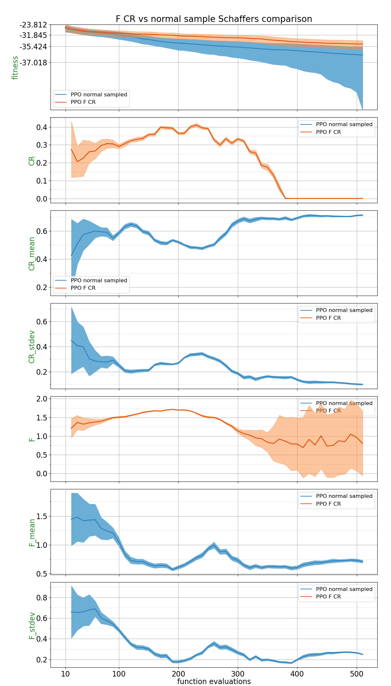
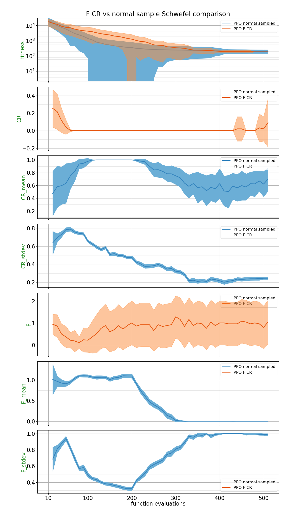
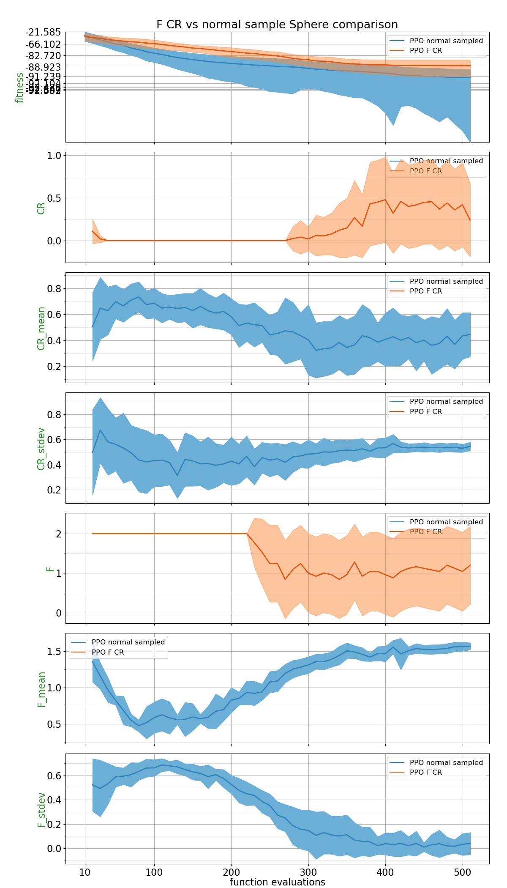
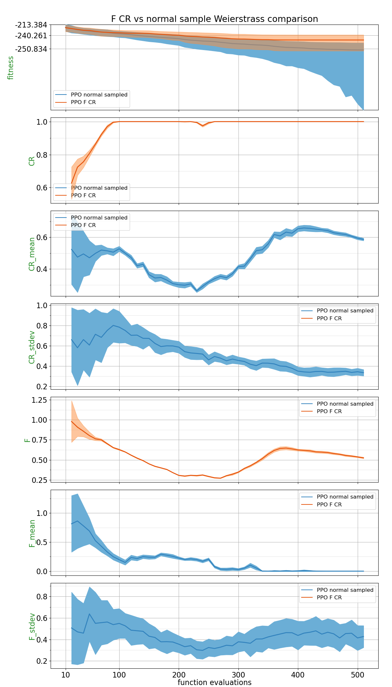

## Comparison Table

Probability of PPO trained policy outperforming CSA using 2 different metrics: Area under the curve and the absolute best of the run.
| Function    | p(PPO normal sampled < PPO F CR) with AUC metric | p(PPO normal sampled < PPO F CR) with best of the run metric |
| :---------- | ------------------------------ | ------------------------------- |
| BentCigar | 0.3116 | 0.1432 |
| Discus | **0.5552** | **0.6164** |
| Ellipsoid | 0.4828 | 0.1736 |
| Katsuura | 0.4968 | **0.5744** |
| Rastrigin | 0.4428 | **0.5232** |
| Rosenbrock | **0.5872** | **0.702** |
| Schaffers | **0.8876** | **0.8712** |
| Schwefel | **0.704** | **0.7244** |
| Sphere | **0.9064** | **0.8876** |
| Weierstrass | **0.7252** | **0.79** |

## Plots

##### BentCigar

##### Discus

##### Ellipsoid

##### Katsuura

##### Rastrigin

##### Rosenbrock

##### Schaffers

##### Schwefel

##### Sphere

##### Weierstrass

