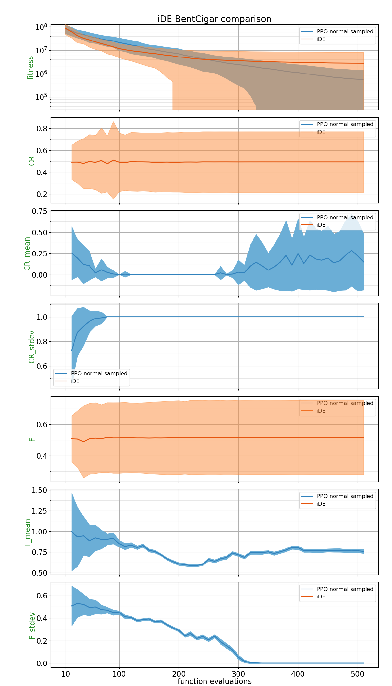
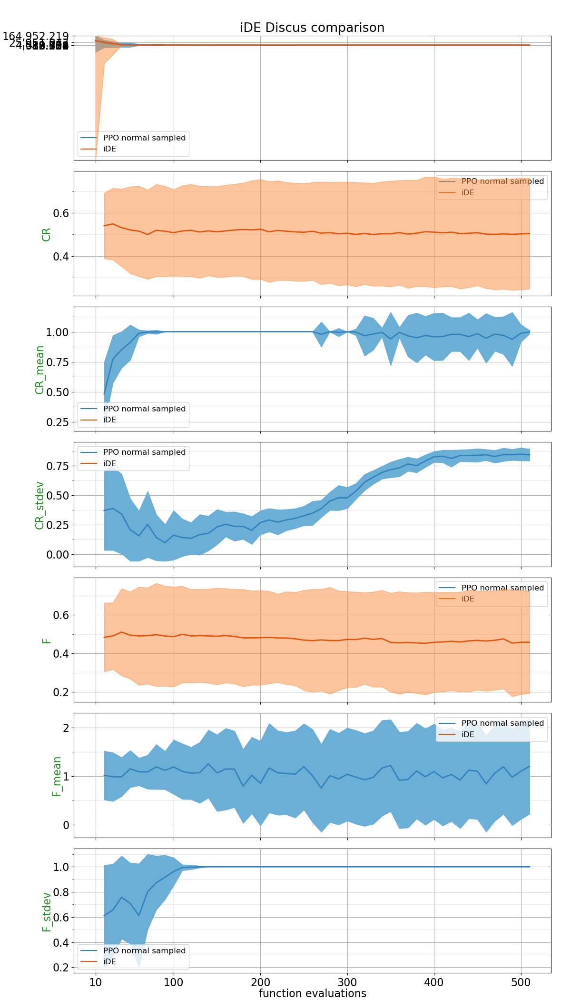
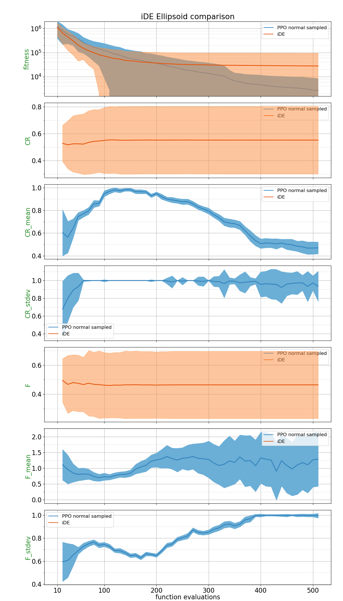
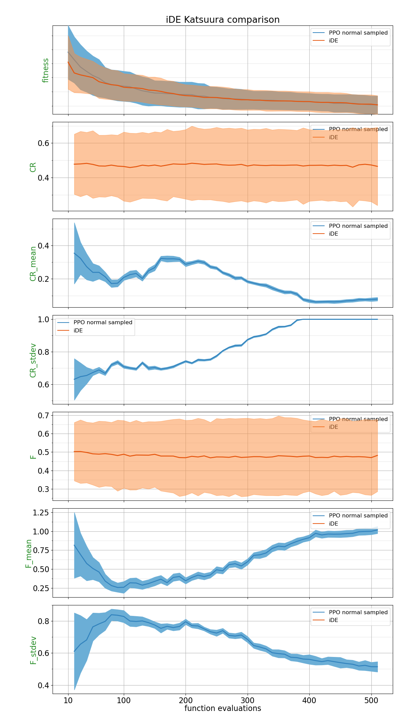
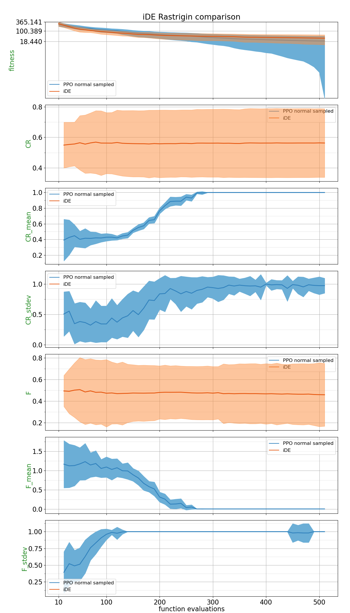
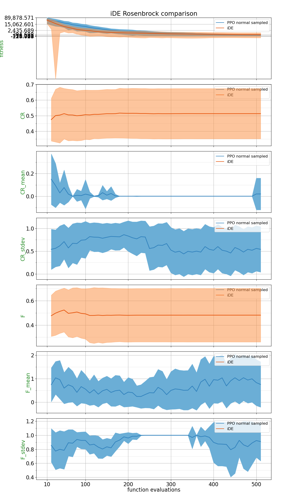
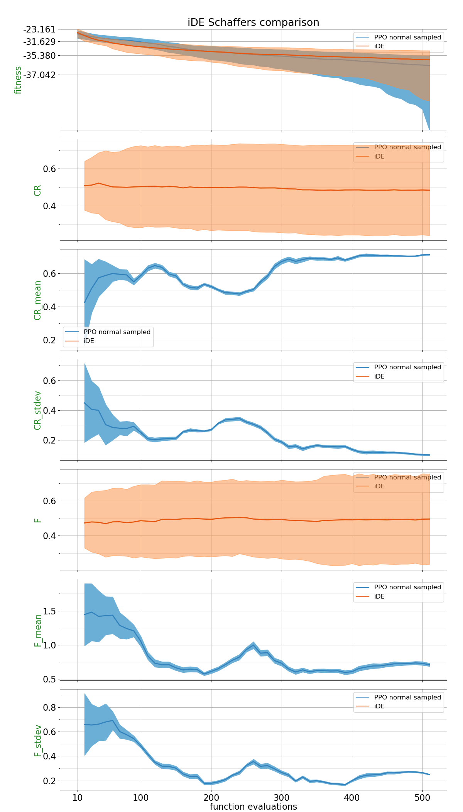
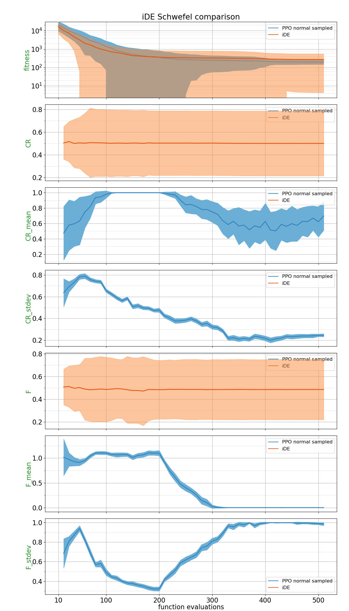
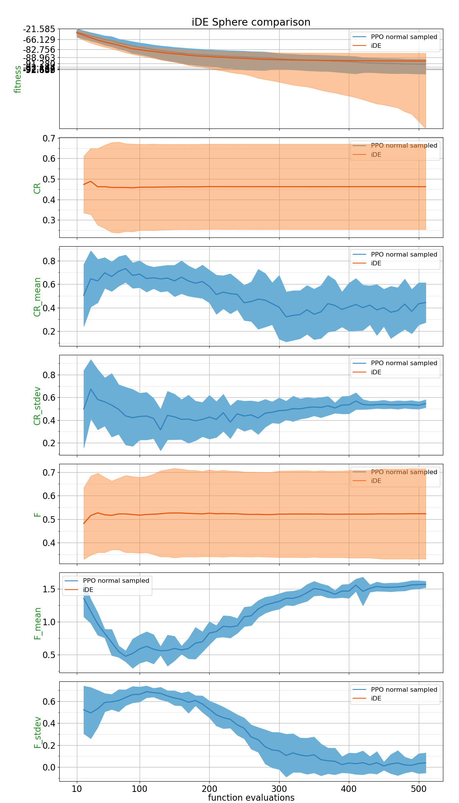
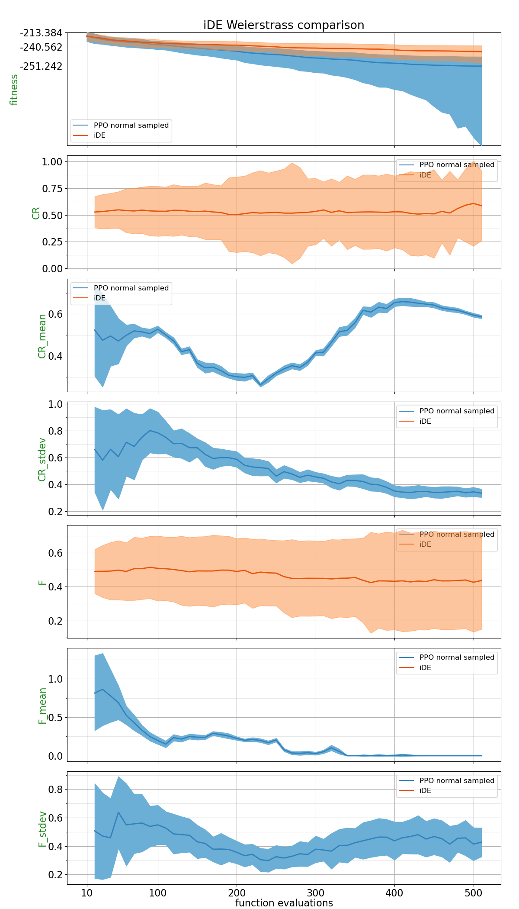

## Comparison Table

Probability of PPO trained policy outperforming CSA using 2 different metrics: Area under the curve and the absolute best of the run.
| Function    | p(PPO normal sampled < iDE) with AUC metric | p(PPO normal sampled < iDE) with best of the run metric |
| :---------- | ------------------------------ | ------------------------------- |
| BentCigar | 0.336 | **0.5264** |
| Discus | 0.4672 | **0.6984** |
| Ellipsoid | 0.3876 | **0.5652** |
| Katsuura | 0.478 | 0.482 |
| Rastrigin | 0.4568 | **0.6592** |
| Rosenbrock | 0.234 | 0.4868 |
| Schaffers | 0.4336 | **0.6004** |
| Schwefel | 0.3296 | **0.5304** |
| Sphere | 0.3948 | 0.4248 |
| Weierstrass | **0.8456** | **0.8172** |

## Plots

##### BentCigar

##### Discus

##### Ellipsoid

##### Katsuura

##### Rastrigin

##### Rosenbrock

##### Schaffers

##### Schwefel

##### Sphere

##### Weierstrass

