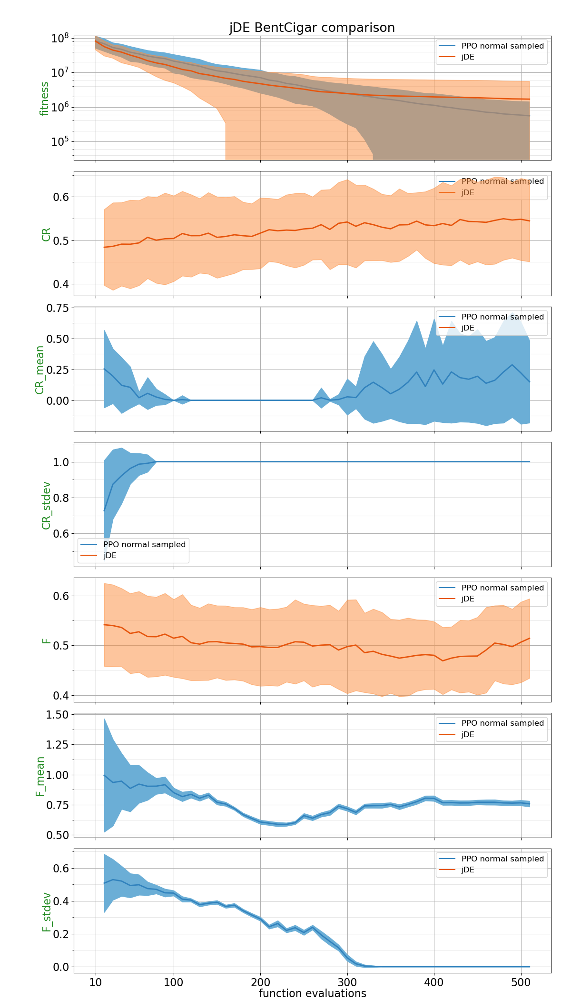
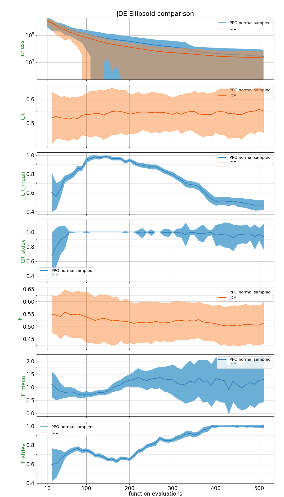
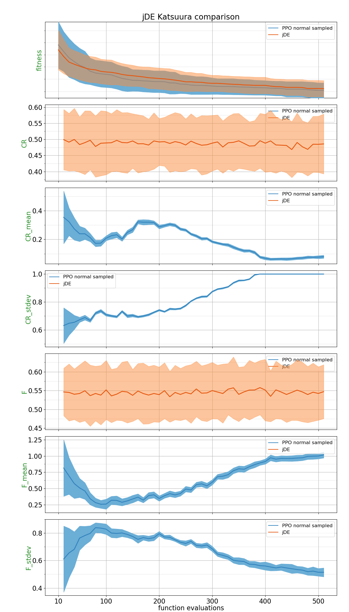
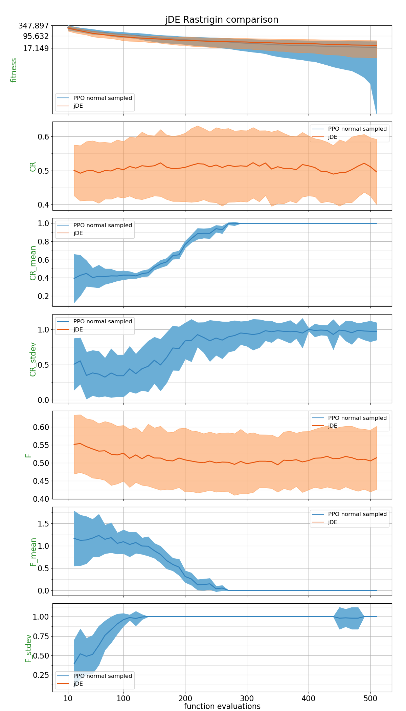
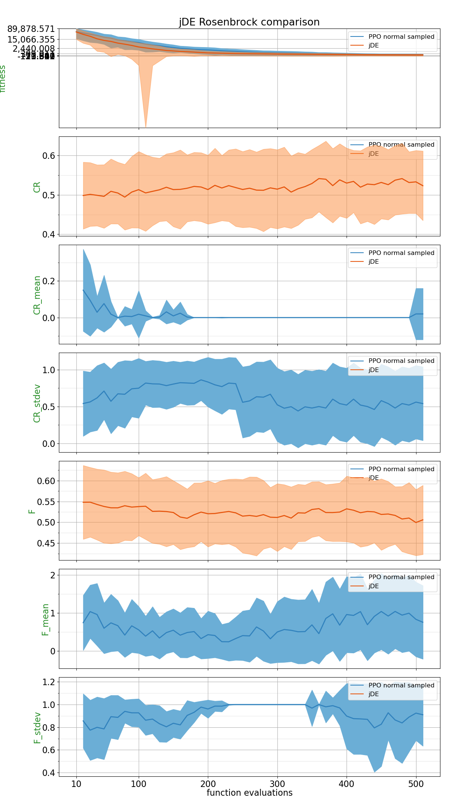
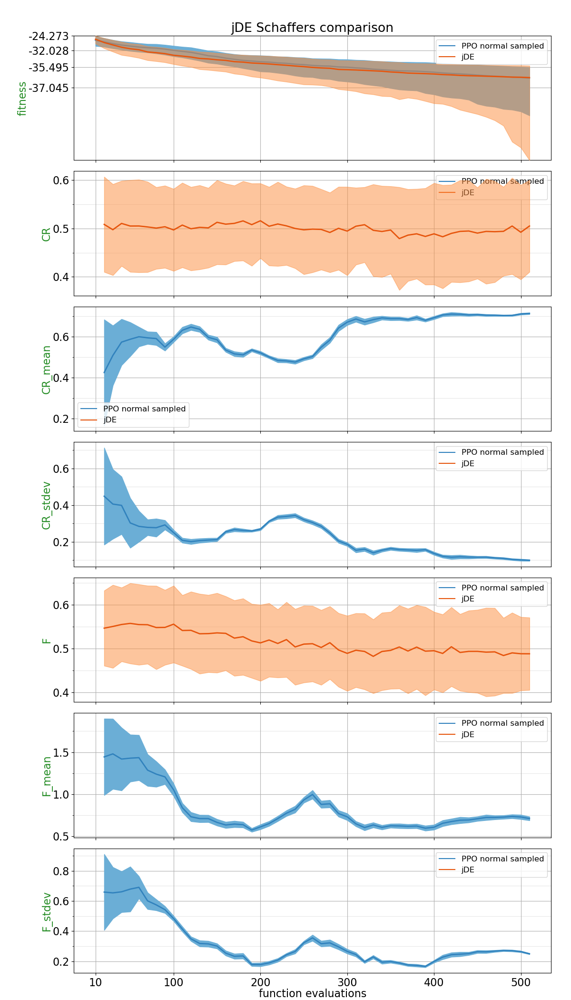
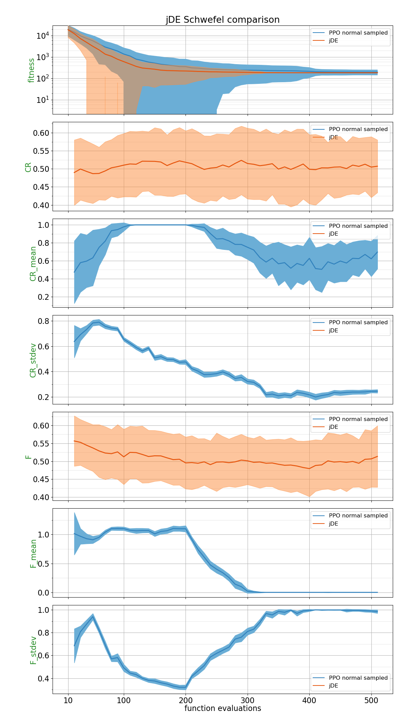
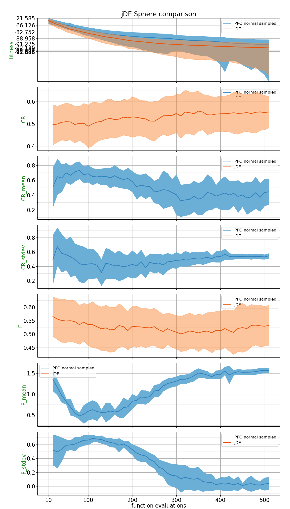
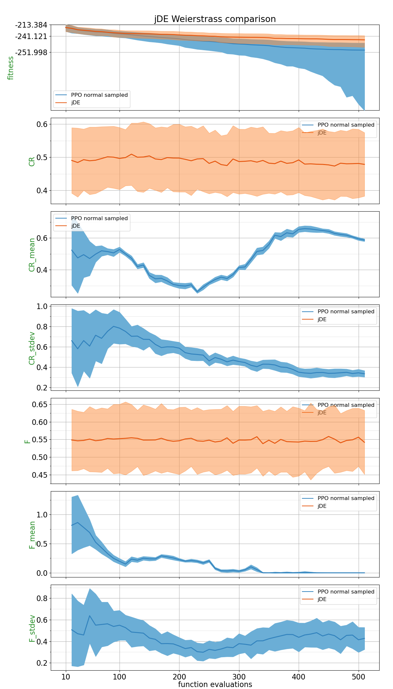

## Comparison Table

Probability of PPO trained policy outperforming CSA using 2 different metrics: Area under the curve and the absolute best of the run.
| Function    | p(PPO normal sampled < jDE) with AUC metric | p(PPO normal sampled < jDE) with best of the run metric |
| :---------- | ------------------------------ | ------------------------------- |
| BentCigar | 0.3044 | **0.5188** |
| Discus | **0.506** | 0.3944 |
| Ellipsoid | 0.3496 | 0.3432 |
| Katsuura | **0.594** | **0.5716** |
| Rastrigin | 0.426 | **0.584** |
| Rosenbrock | 0.2964 | 0.3604 |
| Schaffers | 0.3688 | 0.4964 |
| Schwefel | 0.314 | 0.2352 |
| Sphere | 0.246 | 0.2356 |
| Weierstrass | **0.802** | **0.8476** |

## Plots

##### BentCigar

##### Discus

##### Ellipsoid

##### Katsuura

##### Rastrigin

##### Rosenbrock

##### Schaffers

##### Schwefel

##### Sphere

##### Weierstrass

