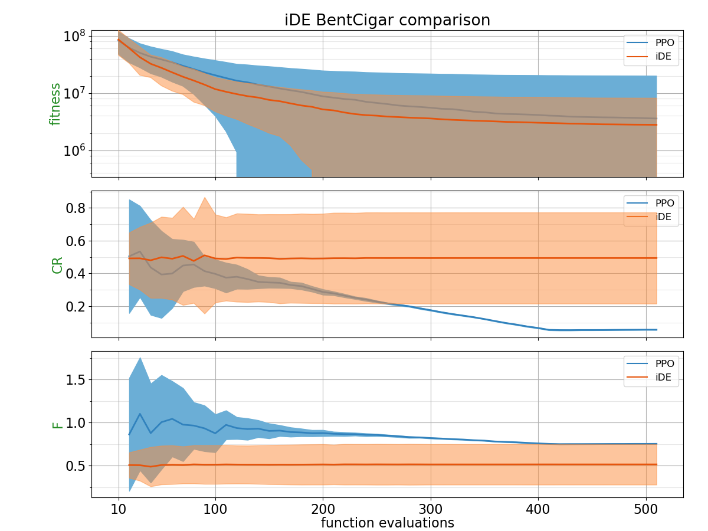
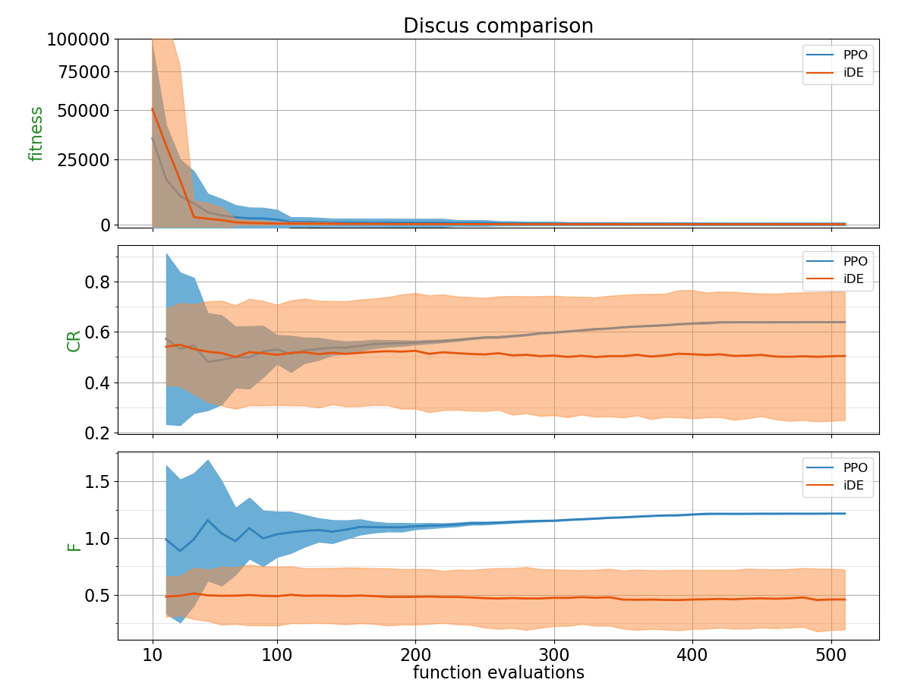
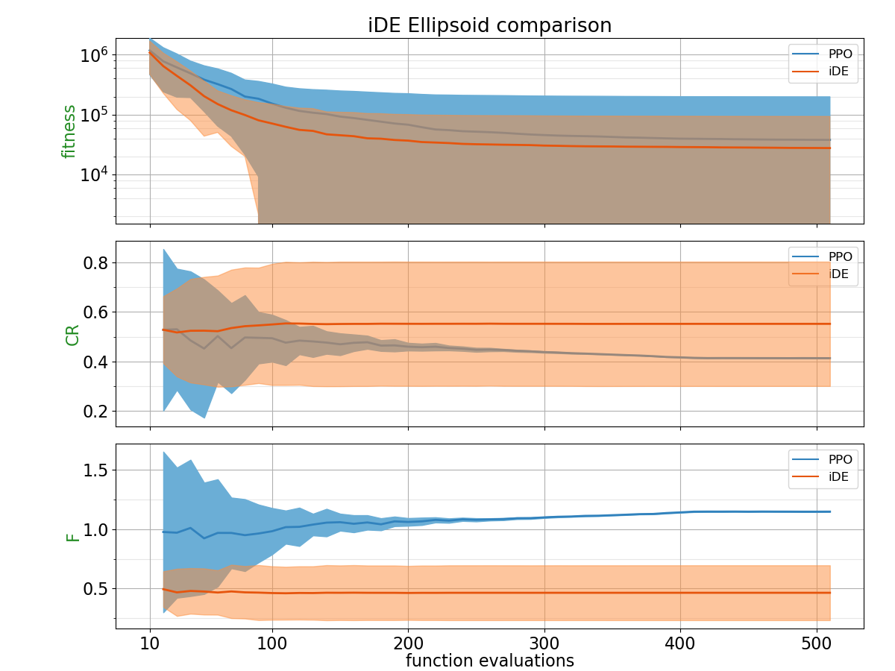
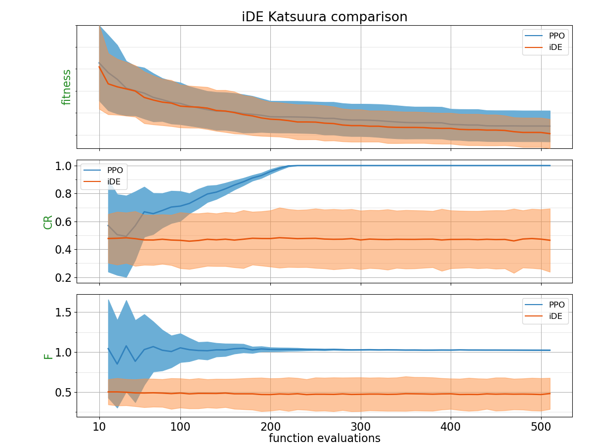
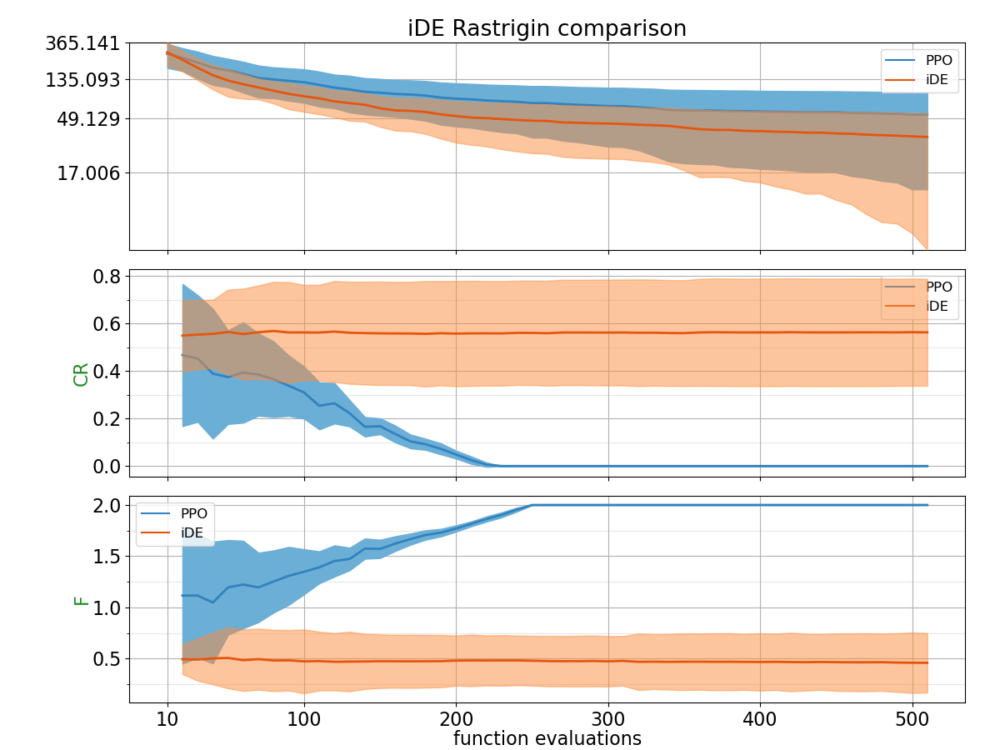
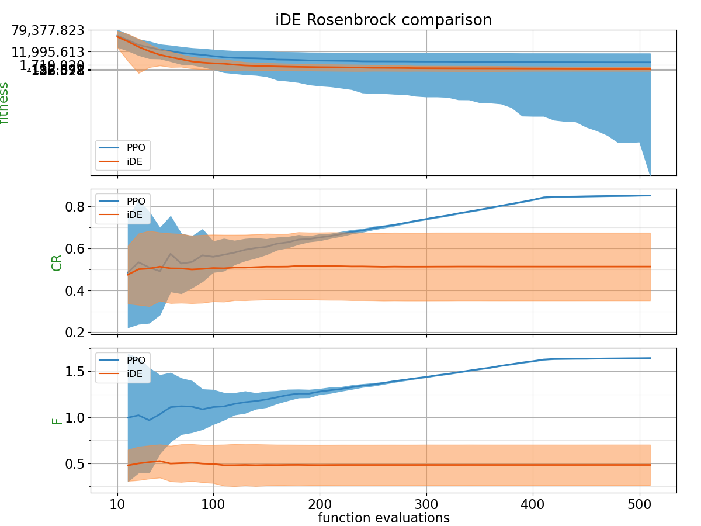
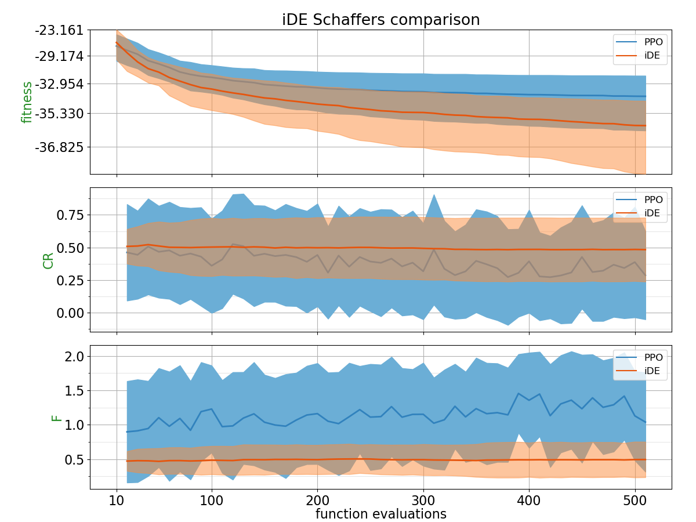
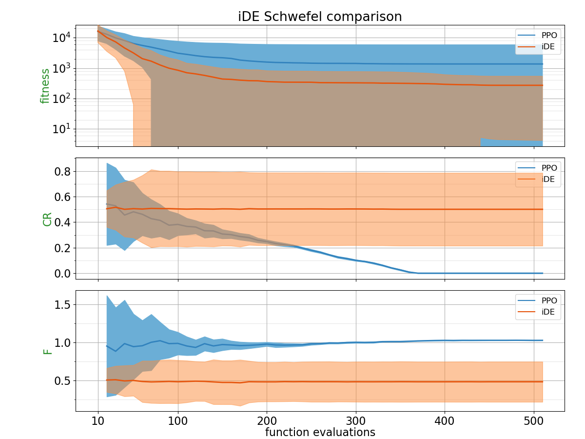
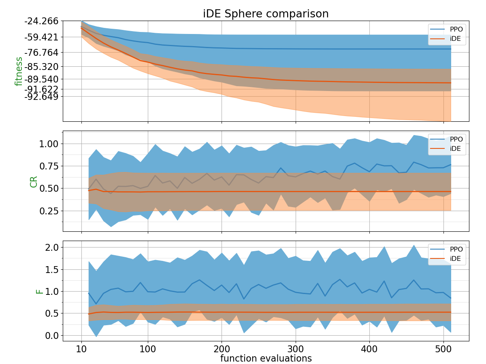
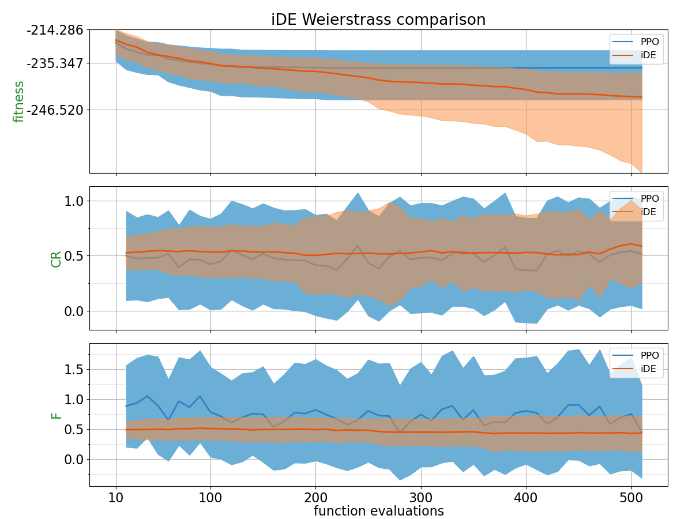

## Comparison Table

Probability of PPO trained policy outperforming CSA using 2 different metrics: Area under the curve and the absolute best of the run.
| Function    | p(PPO < iDE) with AUC metric | p(PPO < iDE) with best of the run metric |
| :---------- | ------------------------------ | ------------------------------- |
| BentCigar | 0.3532 | 0.4128 |
| Discus | 0.4204 | 0.3816 |
| Ellipsoid | 0.3236 | 0.4352 |
| Katsuura | 0.4324 | 0.358 |
| Rastrigin | 0.1988 | 0.232 |
| Rosenbrock | 0.2388 | 0.0932 |
| Schaffers | 0.232 | 0.2172 |
| Schwefel | 0.2524 | 0.3616 |
| Sphere | 0.096 | 0.0892 |
| Weierstrass | 0.3764 | 0.2292 |

## Plots

##### BentCigar

##### Discus

##### Ellipsoid

##### Katsuura

##### Rastrigin

##### Rosenbrock

##### Schaffers

##### Schwefel

##### Sphere

##### Weierstrass

