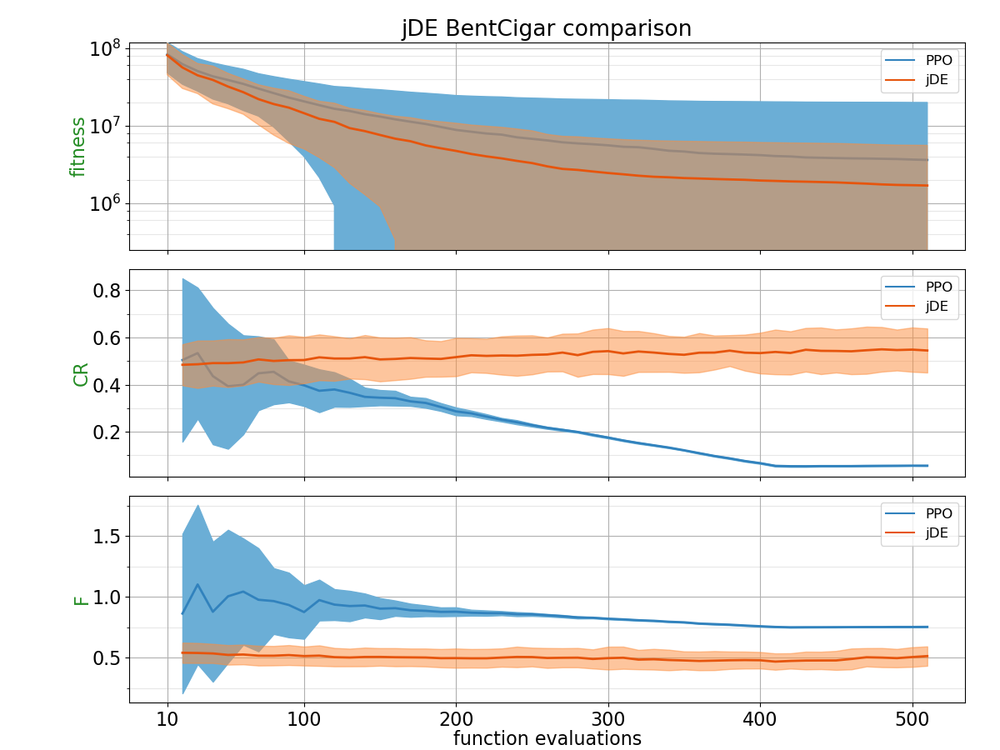
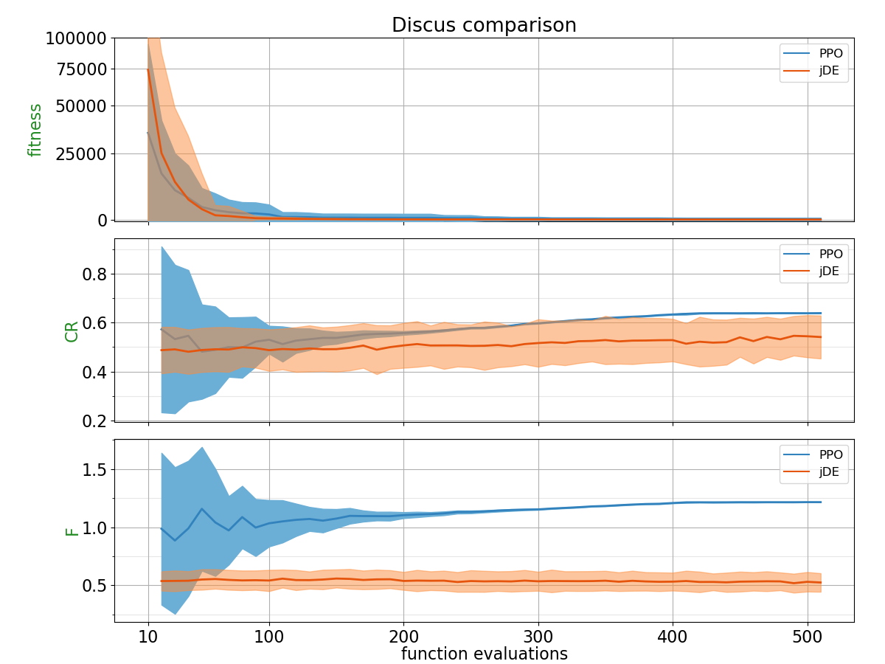
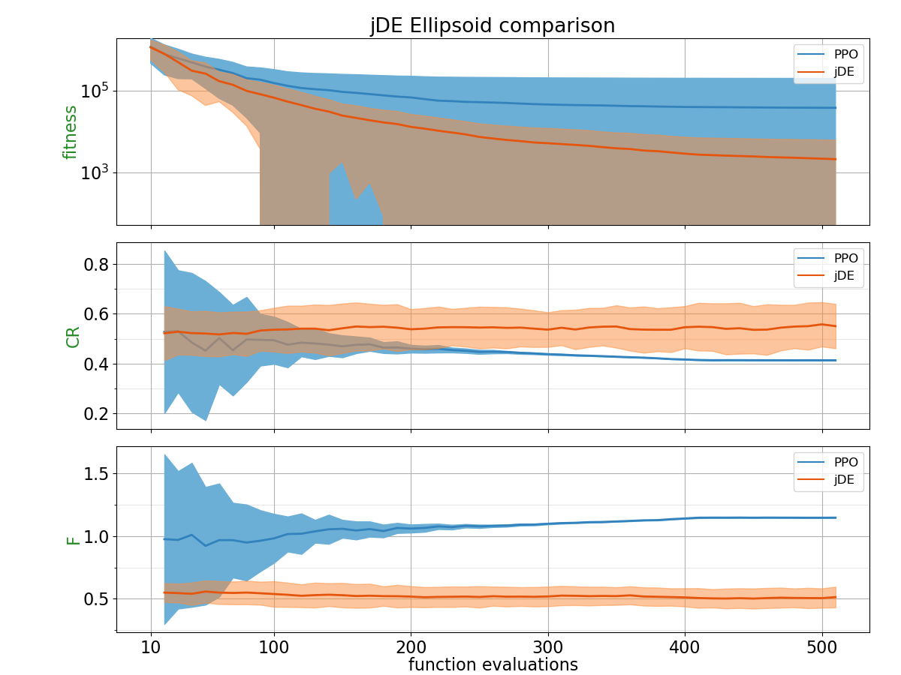
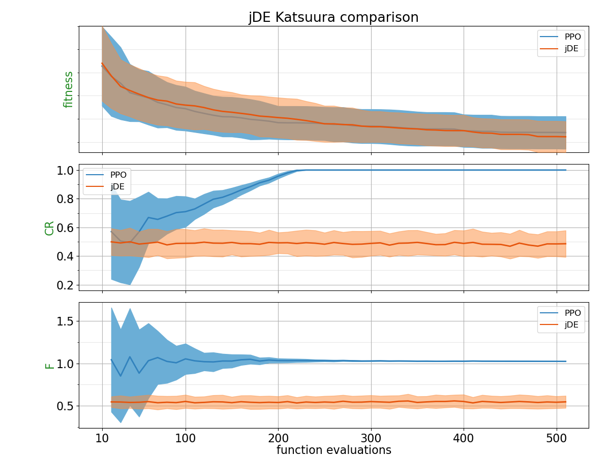
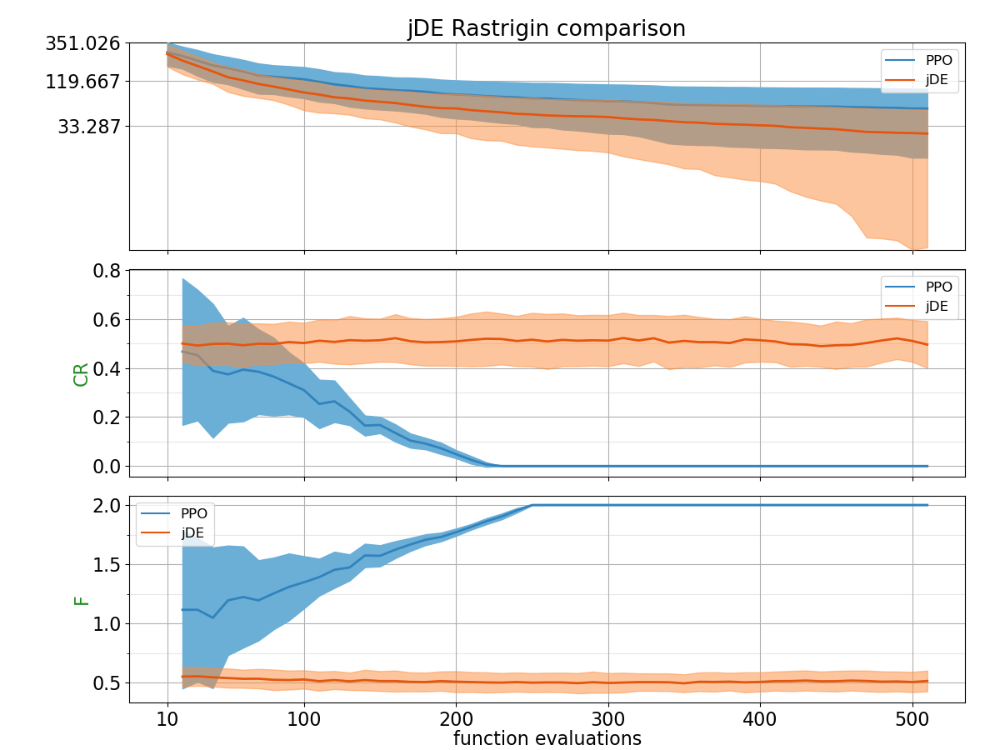
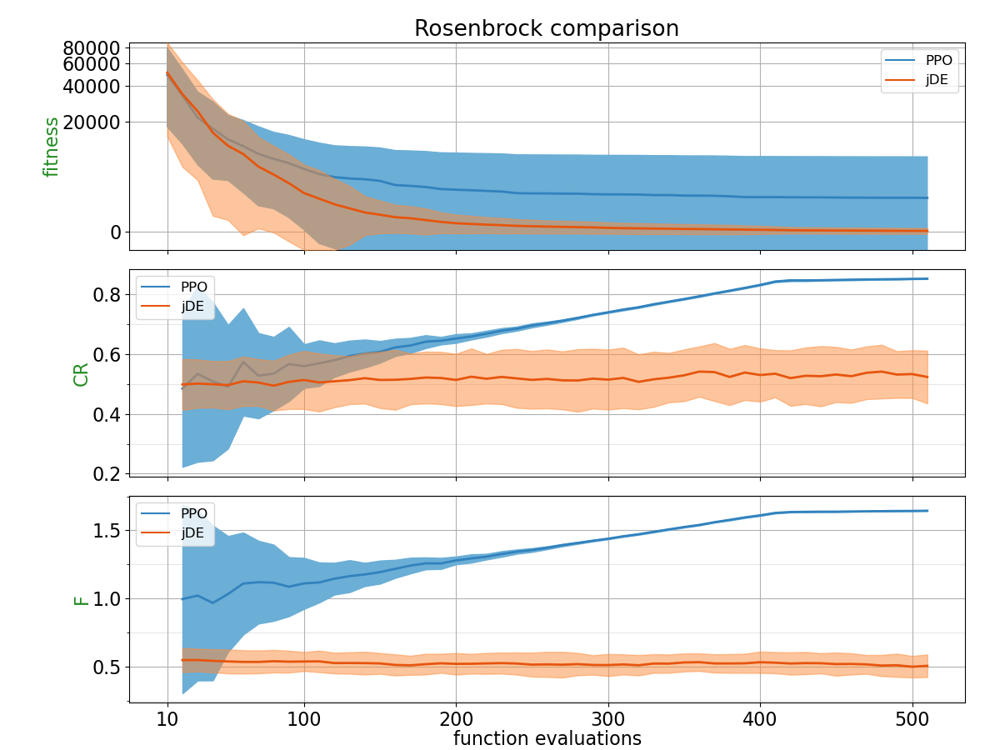
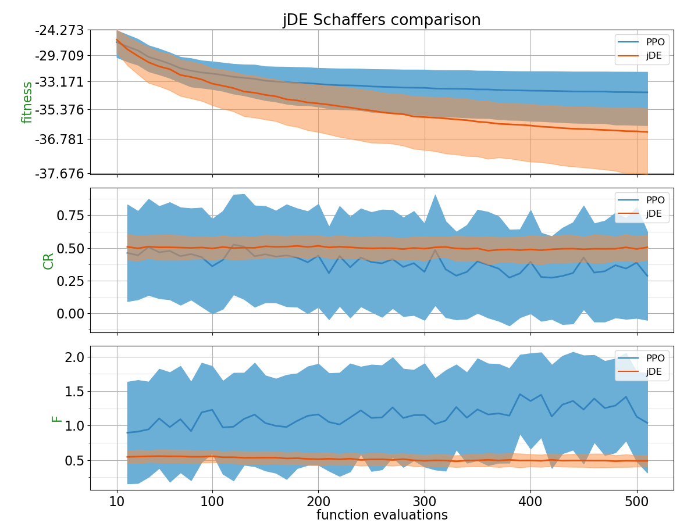
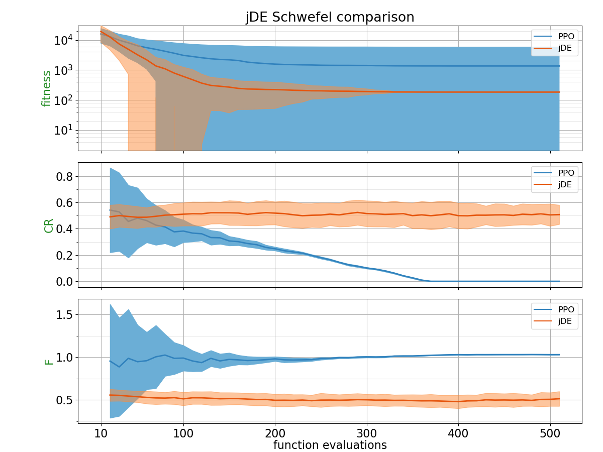
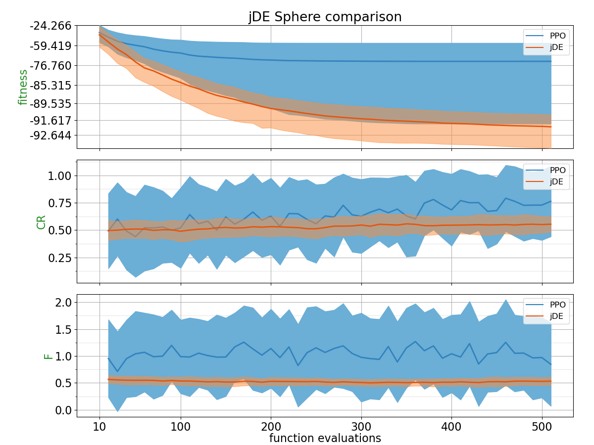
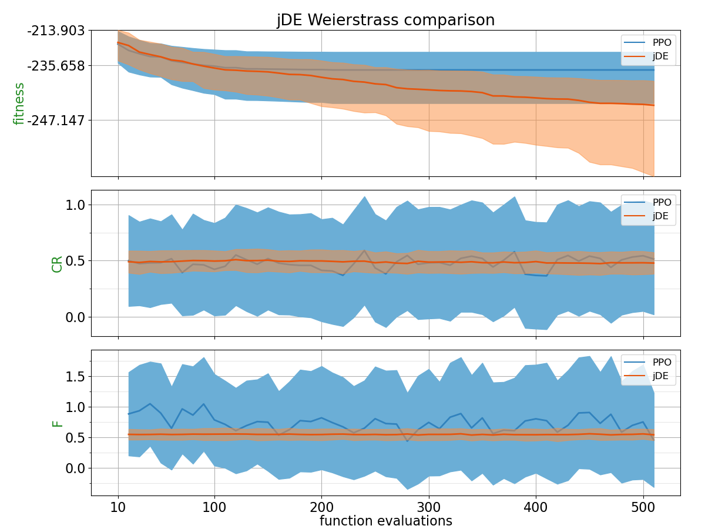

## Comparison Table

Probability of PPO trained policy outperforming CSA using 2 different metrics: Area under the curve and the absolute best of the run.
| Function    | p(PPO < jDE) with AUC metric | p(PPO < jDE) with best of the run metric |
| :---------- | ------------------------------ | ------------------------------- |
| BentCigar | 0.324 | 0.4132 |
| Discus | 0.4552 | 0.1608 |
| Ellipsoid | 0.2796 | 0.214 |
| Katsuura | **0.542** | 0.4548 |
| Rastrigin | 0.2168 | 0.2144 |
| Rosenbrock | 0.2892 | 0.0236 |
| Schaffers | 0.1816 | 0.152 |
| Schwefel | 0.2376 | 0.0932 |
| Sphere | 0.0368 | 0.0156 |
| Weierstrass | 0.3436 | 0.1904 |

## Plots

##### BentCigar

##### Discus

##### Ellipsoid

##### Katsuura

##### Rastrigin

##### Rosenbrock

##### Schaffers

##### Schwefel

##### Sphere

##### Weierstrass

